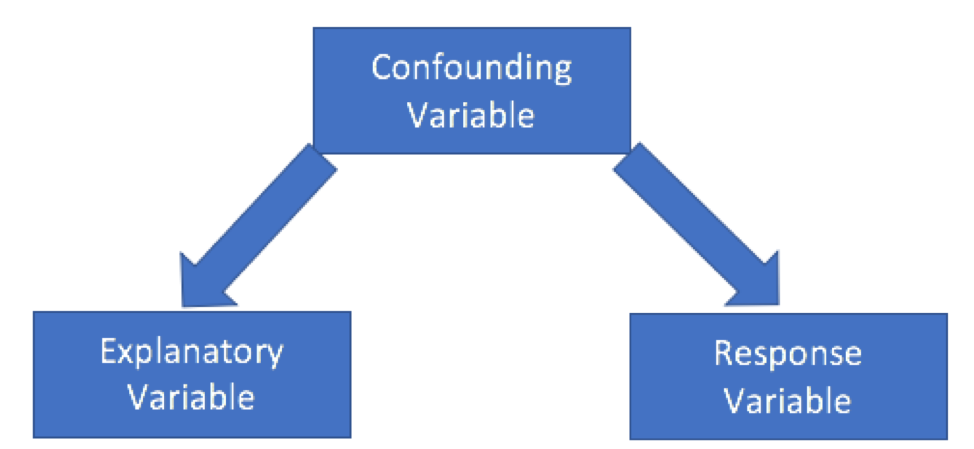
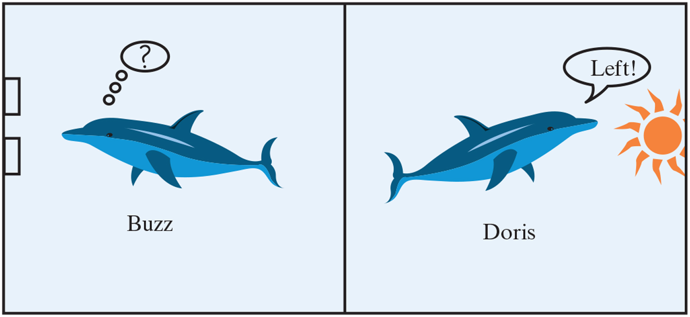
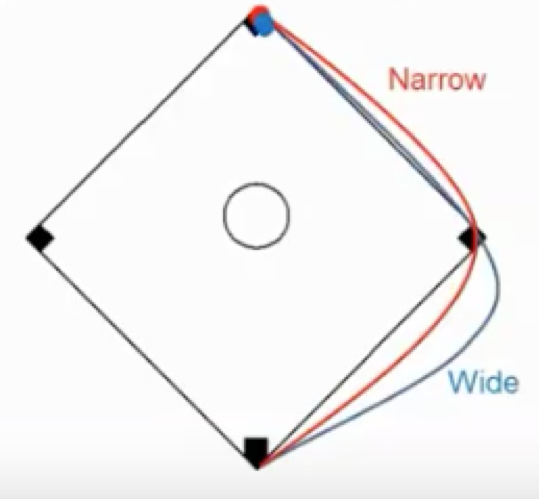
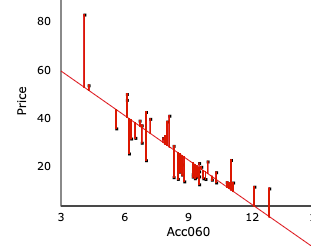
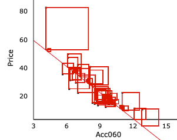

```{r setup, include=FALSE}
knitr::opts_chunk$set(echo = FALSE, message=FALSE, warning=FALSE, fig.height = 2, fig.width = 6)
library(tidyverse)
library(ggformula)
library(gridExtra)
library(knitr)
source("https://raw.githubusercontent.com/AndrewjSage/Stat107_Notes/main/SBI.R")
```


<style>
  .col2 {
    columns: 2 200px;         /* number of columns and width in pixels*/
    -webkit-columns: 2 200px; /* chrome, safari */
    -moz-columns: 2 200px;    /* firefox */
  }
  .col3 {
    columns: 3 100px;
    -webkit-columns: 3 100px;
    -moz-columns: 3 100px;
  }
</style>


# Collecting, Summarizing, and Visualizing Data

## Collecting Data

The notes in this section summarize the most important considerations in collecting data.

A more complete discussion of the topic is given in [Chapter 2 of Introduction to Modern Statistics](https://openintro-ims.netlify.app/data-design.html) by  Mine Cetinkaya-Rundel and Johanna Hardin

### Sample and Population

* A **population** is the entire set of people or items that we are interested in drawing conclusions about. A **parameter** is a numerical property of the population.     

* A **sample** is a subset of individuals or outcomes of interest. A **statistic** is a numerical property of a sample.    

**Example**: We might want to know the proportion of U.S voters who plan to vote for a certain candidate in an upcoming election. Because it is impossible to reach all voters, a polling firm, such as Gallup or Pew, might take a sample of 2,000 randomly selected voters, and ask them who they intend to vote for. Suppose that 900 of these voters in the sample (45%) say that the plan to vote for the candidate. 

In this case, the population would be all U.S. voters, and the population parameter would be the proportion of all U.S. voters who plan to vote for the candidate. The sample would be the 2,000 voters chosen, and the sample statistic would be the proportion of voters in the sample who plan to vote for the candidate (0.45).   

Usually, we will be able to describe the population parameter in words, but will not know its exact value. We will be able to both describe the sample statistic in words, and give its value.   

### Forms of Bias in Observational Studies

In order to generalize results from a sample to a larger population, the sample must be chosen in a way that is representative of the population. 

* **Sampling bias** occurs when certain individuals or groups are more likely to be included in a study than others     
        -Ex: sample only engineering students about self-driving cars    

* **Voluntary response** and **non-response bias** occur when only a small percentage of people selected in a sample respond. Those who respond might be systematically different than those who do not.    
        -Ex: respondents might have stronger opinions (or more time on their hands) than others

* Researchers should randomly select participants and follow up using multiple methods to reach as many individuals as possible      

### Confounding 

A **confounding variable** is a variable related to both the explanatory and response variable, so that its effects cannot be separated from the effects of the explanatory variable. 

```{r,  out.width = "200px", echo=FALSE, fig.align='center'}

```

Examples:     

* Drownings are at their highest on days when there are a lot of ice-cream sales. However, it would be inappropriate to conclude that eating ice cream causes people to drown. People eat ice cream on hot days, and also go swimming on hot days. The confounding variable is temperature.    

* [A 2008 Los Angeles Times article](https://www.latimes.com/archives/la-xpm-2008-jan-03-sci-heart3-story.html) begins: "People who suffer cardiac arrest are more likely to survive if they are in a casino or airport than if they are in a hospital, researchers said today." It's true that a higher percentage of people who suffered a heart attack while in an airport or casino survived, compared to those who suffered the heart attack while in a hospital. However, people who are in the hospital tend to be in poorer health to begin with than those in airports or casinos, making them less likely to survive a heart attack. The confounding variable is prior health.    

* A [2012 article]((https://consumer.healthday.com/kids-health-information-23/child-development-news-124/early-language-skills-reduce-preschool-tantrums-study-finds-671773.html)) was titled “Early Language Skills Reduce Preschool Tantrums, Study Finds” . The article suggests that the ability to verbalize their frustrations makes children less likely to throw a tantrum. While this may be true, it is also possible that other variables, such as the amount of attention the child receives from their parents affects both the child's verbal skills and their likelihood of throwing tantrums. In this case, attention from parents would be a confounding variable.   


### Observational Studies and Experiments

* An **observational study** is a study in which researchers observe individuals and measure variables of interest but do not intervene in order to attempt to influence responses     

* An **experiment** is a study in which experimental units are randomly assigned to two or more treatment conditions and the explanatory variable is actively imposed on the subjects     

In an observational study, we can never conclude that one variable causes a change in the other due to the possibility of confounding variables
    
In an experiment, we may conclude that one variable causes a change in the other since we have controlled for confounding variables

### Principles of Good Experiments {.smaller}

Well-designed experiments follow the first three principles listed below. Sometimes, the fourth principle is also important.  

1. **Control**: Researchers assign subjects to different treatments to control for differences between groups. 

2. **Randomization** Subjects are randomly assigned to groups so that there are no systematic differences between groups, which could introduce confounding factors.    

3. **Replication** The more subjects are studied, the more precisely we can estimate effects being studied. 

4. **Blocking** Some experiments group patients with similar characteristics, such as good health or poor health before assigning treatments. This assures that each treatment group has the same number of good health and poor health treatments. Not all experiments need to use blocking.      


**Other experiment vocabulary:**

A **placebo** is a fake treatment given to account for the possibility of subjects experiencing an effect simply from believing they received a treatment. 

 A **double blind** experiment is one in which neither the subjects nor the people administering the treatment know whether the subject received a treatment or placebo


### Inferring Causation and Generalizing Results

* We can only generalize from sample to population when a sample is randomly selected. 

* We can only infer causation when using a randomized experiment. 


|             |  Treatments Randomly Assigned | Treatments Not Randomly Assigned | 
|-----------|----------|-----------|
| Sample Randomly Collected | Can infer causation and generalize to population   |  Can generalize results    | 
| Sample Not Randomly Collected   | Can infer causation   |  Cannot infer causation or generalize results   | 

\newpage

## Visualizing Data

### 2018 Movies 

```{r, echo=F, fig.width=7, fig.height=4, fig.align='center', message=FALSE, warning=FALSE}
library(ggformula)
library(gridExtra)
library(tidyverse)
library(knitr)
movies <- read.csv("movies2018.csv")
movies <- movies %>% select(-c(meta_score, vote))
names(movies) <- c("Title", "IMDB", "Rating", "Genre", "Runtime", "Revenue")
```

We will look at a dataset with information on 272 movies released in 2018, which was obtained from https://www.imdb.com/. 

We have information on each film's

* IMDB score (score of 1-10 by users of IMDB.com) 
* MPAA Rating (PG, PG-13, R, Not Rated)    
* Genre (Action, Comedy, Drama, etc.)     
* Runtime (in minutes)    
* Revenue (worldwide revenue in millions)

### Biggest Moneymakers 

Movies that generated more than $250 million in revenue:

```{r, echo=FALSE}
movies %>% filter(Revenue > 250)  %>% arrange(desc(Revenue))
```

### Observational Units and Variables

The rows of the datasets are called **observational units.**    
        -Films are the observational units in this dataset.

The columns of the datasets are called **variables.**

A **quantitative variable** is one that takes on numeric values    
    - Examples: IMDB, Runtime, Revenue     
    
A **categorical variable** is one where outcomes are a set of categories     
    -Examples: Rating, Genre


### Bar Graphs

Bar graphs are used to display frequencies for categorical variables. 

```{r, echo=FALSE, fig.height=4, fig.width=9}
gf_bar( ~ Genre, data = movies, fill="orange") %>% 
  gf_labs(title="Number of Movies by Genre", y="Frequency of Movies")
```

The y-axis displays the frequency, or number of films in each category.   

### Stacked Bar Graphs

Stacked bar graphs display information on 2 categorical variables such as Genre and Rating

```{r, echo=FALSE, fig.height=4, fig.width=9}
gf_bar( ~ Genre, data = movies, fill=~Rating) %>% 
  gf_labs(title="Movie Ratings by Genre", y="Frequency")
```

### Histograms

Histograms are similar to bar graphs and are used to display quantitative variables. In a histogram, the x-axis contains numbers, rather than categories. 

The y-axis again shows frequency (number of films in each category).   

```{r, echo=F, fig.width=10, fig.height=3, fig.align='center', message=FALSE, warning=FALSE}
movies_hist <- gf_histogram(~ IMDB, data = movies, bins=15, boundary=0, fill="blue", color="black") %>% 
  gf_labs(title="Histogram of IMDB score (out of 10)", x="IMDB score", y="Frequency") 

movies_hist
```

* movies most often got scores between 6 and 7.5.  
* middle 50% of movies scored between 5.7 and 7.1 (region in box)    
* A few movies scored much lower than the rest (outliers)

### Boxplot

A boxplot displays the range of values for a quantitative variable. 

```{r, echo=F, fig.width=10, fig.height=3, fig.align='center', message=FALSE, warning=FALSE}
movies_bp <- gf_boxplot(IMDB ~ 1, data = movies)  %>%
  gf_labs(title="Boxplot of IMDB score (out of 10)", y="IMDB score") %>%gf_refine(coord_flip()) +
        theme(axis.title.y=element_blank(),
        axis.ticks.y=element_blank(),
        axis.text.y=element_blank())
movies_bp 
```

Data are divided into 4 categories. 

* The lowest 25% are to the left of the box. 
* The next 25% of the data are in the left side of the box, to the left of the line.   
* The next 25% are in the right side of the box, so the right side of the box represents the 75th percentile in the data. 
* The highest 25% are to the right of the box.   


* The left side of the box represents the point that 25% of the data lie below, called the **25th percentile**.        
* The line through the box represents the median, the 50th percentile.   
* The right side of the box represents the point that 75% of the data lie below, called the **75th percentile**.    

Although the parts of the plot may have different widths, they each contain the same number of observations, as illustrated below. 

```{r, echo=F, fig.width=10, fig.height=3, fig.align='center', message=FALSE, warning=FALSE}
movies_bp <- gf_boxplot(IMDB ~ 1, data = movies)  %>%
  gf_labs(title="Boxplot of IMDB score (out of 10)", y="IMDB score") %>%gf_refine(coord_flip()) +
        theme(axis.title.y=element_blank(),
        axis.ticks.y=element_blank(),
        axis.text.y=element_blank()) + geom_jitter()
movies_bp 
```

* the lowest IMDB score was 2.1    
* 25% of films had IMDB scores less than 6.5    
* The median score was 6.5    
* 75% of films had IMDB scores less than 7.1    
* The highest IMDB score was 8.6    

The width of the box, representing the middle 50% of the data, is called the **inter-quartile range (IQR).** 


### Scatterplots

Scatterplots display the relationship between two quantitative variables. 

```{r, echo=FALSE, fig.height=3, fig.width=6}
gf_point(data=movies, IMDB ~ Runtime)
```

* Longer movies tend to get higher scores, on average.


```{r, echo=FALSE, fig.height=3, fig.width=6}
gf_point(data=movies, log(Revenue) ~ IMDB)
```

* There does not appear to be a relationship between Revenue and IMDB score


\newpage

## Measures of Center and Spread

### Describing Center {.smaller}

Two common measures of center are the mean and the median.  

The mean is the numerical average, while the median represents the middle number.   

```{r, echo=F, fig.width=10, fig.height=2.5, fig.align='center', message=FALSE, warning=FALSE}
movies_hist <- gf_histogram(~ IMDB, data = movies, bins=15, boundary=0, fill="blue", color="black") %>% 
  gf_labs(title="Histogram of IMDB score (out of 10)", x="IMDB score", y="Frequency") 
movies_bp <- gf_boxplot(IMDB~1, data = movies)  %>%
  gf_labs(title="Boxplot of IMDB score (out of 10)", y="IMDB score") %>%gf_refine(coord_flip()) +
        theme(axis.title.y=element_blank(),
        axis.ticks.y=element_blank(),
        axis.text.y=element_blank())
grid.arrange(movies_hist, movies_bp, ncol=2) 
```

```{r}
median(movies$IMDB)
```

```{r}
mean(movies$IMDB)
```

In roughly symmetric dataset, the mean and median are approximately the same. 

### Skewed Data

```{r, echo=F, fig.width=10, fig.height=3, fig.align='center', message=FALSE, warning=FALSE}
movies_hist <- gf_histogram(~ Revenue, data = movies, bins=15, boundary=0, fill="blue", color="black") %>% 
  gf_labs(title="Histogram of Movie Revenues", x="Revenue in Millions", y="Frequency")
movies_bp <- gf_boxplot(Revenue~1, data = movies) %>% 
  gf_labs(title="Boxplot of Movie Revenues", y="Revenue in Millions") %>%gf_refine(coord_flip()) +
        theme(axis.title.y=element_blank(),
        axis.ticks.y=element_blank(),
        axis.text.y=element_blank())
grid.arrange(movies_hist, movies_bp, ncol=2)
```

This distribution is said to be *right-skewed*. Most movies made less than $50 million, but a few made much more, creating a "tail," or long "whisker" going to the right. 


```{r}
median(movies$Revenue)
```

```{r}
mean(movies$Revenue)
```

In a right-skewed distribution, the mean is considerably larger than the median, since a few very large observations pull the mean up considerably, but don't change the middle number in the dataset. 

In a left-skewed dataset, the mean would be less than the median. 

In these situations, the median is usually a better indicator of a "typical" value. 

### Comparative Boxplots

```{r, echo=F, fig.width=6, fig.height=4, fig.align='center', message=FALSE, warning=FALSE}
gf_boxplot(IMDB ~ Genre, data = movies %>% filter(Genre %in% c("Comedy", "Drama"))) %>% 
  gf_labs(title="Comedies and Dramas", y="IMDB Score") %>% gf_refine(coord_flip()) 
```

1. On average, dramas score higher than comedies. 
2. There is more variability in scores for comedies than dramas. 

### Standard Deviation and Interquartile Range

There are two common ways to measure the amount of variability in data:   

* Interquartile range (IQR) - range of middle 50% of data, i.e. width of the box    
* Standard deviation - roughly the average difference between individual observations and the mean  

The higher the IQR or standard deviation, the more variability in the data. 

### Summary Statistics for PG and PG-13 Runtimes

```{r, echo=FALSE}
kable(movies %>% filter(Genre %in% c("Comedy", "Drama")) %>% 
  group_by(Genre) %>% summarize(Mean=mean(IMDB), 
                                      median=median(IMDB),
                                      IQR=IQR(IMDB),
                                      stdev=sd(IMDB)))
```

* Dramas tend to score higher on average.  
* There is more variability in scores for comedies than for dramas. 


\newpage

# Hypothesis Tests for Categorical Data    


## Hypothesis Test for One Proportion: Dolphin Communication


### Dolphins Study


```{r Dolphins, echo=FALSE, fig.cap="Image from [http://www.bbc.com](http://www.bbc.com/future/story/20130613-decoding-the-language-of-dolphins)", out.width = '50%'}

```

Pioneer research in marine biology (1960's) studied whether dolphins could communicate with each other beyond relaying simple feelings. Dr. Jarvis Bastian conducted experiment involving two dolphins, Doris and Buzz. 

The following description comes from Chapter 1 of *Introduction to Statistical Investigations* by Tintle et al.(http://www.isi-stats.com/isi/Chapter%201_5_20_14.pdf) 


*A famous study from the 1960s explored whether two dolphins (Doris and Buzz) could communicate abstract ideas. Researchers believed dolphins could communicate simple feelings like “Watch out!” or “I’m happy,” but Dr. Jarvis Bastian wanted to explore whether they could also communicate in a more abstract way, much like humans do. To investigate this, Dr. Bastian spent many years training Doris and Buzz and exploring the limits of their communicative ability.*

*During a training period lasting many months, Dr. Bastian placed buttons underwater on each end of a large pool—two buttons for Doris and two buttons for Buzz. He then used an old automobile headlight as his signal. When he turned on the headlight and let it shine steadily, he intended for this signal to mean “push the button on the right.” When he let the headlight blink on and off, this was meant as a signal to “push the button on the left.” Every time the dolphins pushed the correct button, Dr. Bastian gave the dolphins a reward of some fish. Over time Doris and Buzz caught on and could earn their fish reward every time.*

*Then Dr. Bastian made things a bit harder. Now, Buzz had to push his button before Doris. If they didn’t push the buttons in the correct order—no fish. After a bit more training, the dolphins caught on again and could earn their fish reward every time. The dolphins were now ready to participate in the real study to examine whether they could communicate with each other. Dr. Bastian placed a large canvas curtain in the middle of the pool. (See Illustration below) Doris was on one side of the curtain and could see the headlight, whereas Buzz was on the other side of the curtain and could not see the headlight.*

*Dr. Bastian turned on the headlight and let it shine steadily. He then watched to see what Doris would do. After looking at the light, Doris swam near the curtain and began to whistle loudly. Shortly after that, Buzz whistled back and then pressed the button on the right—he got it correct and so both dolphins got a fish. But this single attempt was not enough to convince Dr. Bastian that Doris had communicated with Buzz through her whistling. Dr. Bastian repeated the process several times, sometimes having the light blink (so Doris needed to let Buzz know to push the left button) and other times having it glow steadily (so Doris needed to let Buzz know to push the right button). He kept track of how often Buzz pushed the correct button.* 


```{r Doris_Buzz1, echo=FALSE, fig.cap="Image from Introduction to Statistical Investigation by Tintle et al.", out.width = '50%'}

```

**Results**

Dr. Bastian had Buzz attempt to push the correct button a total of 16 different times. Of these, Buzz successfully pushed the correct button in 15 of the 16 attempts.

We'll perform a statistical investigation to investigate whether these results provide evidence that the dolphins are, in fact, communicating with one another. 

```{r, echo=FALSE}
Outcome <- c(rep("Correct", 15), rep("Incorrect",1))
Outcomes <- data.frame(Outcome)
gf_bar( ~Outcome, data=Outcomes, fill="lightblue") %>% 
  gf_labs(title="Dolphins Results")
```

### Question of Interest

Suppose that Buzz was not communicating with Doris at all and was just guessing which button to push. How many times (out of the 16 attempts) would you expect him to push the correct button? Do you think it would be unusual to get 15 out of 16 correct if he is just guessing?

How could we use a coin to investigate the likelihood of Buzz getting 15 out of 16 right, just by guessing?


### Coin-Flipping App

We'll use an [App](https://www.rossmanchance.com/applets/2021/oneprop/OneProp.htm) to simulate flipping a coin 16 times and see how often we get 15 or more heads.    

Based on our results, does it seem likely that the dolphins were just guessing?   

### Simulation-Based Test in R

```{r, echo=FALSE}
set.seed(07022023)
```

```{r, echo=FALSE}
# n represents sample size
# x represents successes
# p-represents success proportion from null hypothesis
# alternative represents direction of alternative hypothesis (either "greater", "less" or "two.sided")
# reps represents number of simulations to perform.  

SimulateProportion(n=16, x=15, p=0.5, alternative="greater", reps=10000)
```

We got a proportion of 0.9375 or higher in only 1 out of 10,000 simulations (0.0001 of the simulations).   


### Hypothesis Testing Terminology    

* A **hypothesis test** is statistical investigation that determines the likelihood of getting a result like the one we saw in our data by chance.    

We use hypothesis tests to evaluate the strength of evidence involving statements about population parameters, using sample statistics.    

In the dolphins example, the parameter of interest is the proportion of time the dolphins choose the correct button in the long-run. (That is if they were to attempt to communicate and press the button many, many times.)

* The **null hypothesis** is a statement about what we would expect if our result was due only to chance.    
     Example: The null hypothesis is that the dolphins are just guessing which button to pick, so that in the long run, the proportions of attempts they would get correct is 0.5. Since the parameter of interest is a proportion, we'll use the sybol $p$, so the null hypothesis in symbols is $p=0.5$.   
     
* The **alternative hypothesis** is a statement that contradicts the null hypothesis.   
     Example: The alternative hypothesis is that the dolphins are not randomly guessing and the proportion of attempts they will get correct in the long run is greater than 0.5 ($p>0.5$)     
     
* In a hypothesis test, the sample statistic used is called a **test statistic**.     
     Example: The test statistic is the proportion of attempts the dolphins got correct in the sample. In this case it's 15 out of 16. When the statistic is a proportion, we'll use the symbol $\hat{p}$. Here $\hat{p} = \frac{15}{16}$.   
     
* The **p-value** is the probability of obtaining a result as or more extreme than we did, when the null hypothesis is true. 
     Example: the p-value represents the probability of the dolphins getting 15 or more of the 16 attempts correct, if they would get 50% of their attempts correct in the long run. In our simulation, the p-value was 0.0001, which is very small.    
     
     **small p-values provide evidence against the null hypothesis!**
     
 It appears that the dolphins were not just randomly guessing. Provided there was no other way for Buzz to see the light, there is evidence that they really were communicating.   
 
### Follow-up Studies

In order to make general claims about dolphin communication, this (or similar) experiments need to be conducted on other dolphins than just Buzz and Doris. Subsequent research has provided evidence that dolphins are highly intelligent mammals, capable of high-level communication.

[National Geographic Article](https://www.nationalgeographic.com/magazine/2015/05/dolphin-intelligence-human-communication/)

### What if...

What if Buzz had only been right on 10 of the 16 tries. Would this change our conclusion?

```{r, echo=FALSE}
Outcome <- c(rep("Correct", 10), rep("Incorrect",6))
Outcomes <- data.frame(Outcome)
gf_bar( ~Outcome, data=Outcomes, fill="lightblue") %>% 
  gf_labs(title="Hypothetical Results")
```

The simulation-based hypothesis test would look like this.  

```{r, echo=FALSE}
set.seed(07022023)
```

```{r, echo=FALSE}
# n represents sample size
# x represents successes
# p-represents success proportion from null hypothesis
# alternative represents direction of alternative hypothesis (either "greater", "less" or "two.sided")
# reps represents number of simulations to perform.  

SimulateProportion(n=16, x=10, p=0.5, alternative="greater", reps=10000)
```
 
The probability of the dolphins getting a proportion of 0.9375 correct in 16 flips is approximately $0.2307$. 

This p-value is large, so it is plausible that the dolphins would have gotten 10 or more correct by randomly guessing. We would not have evidence against the null hypothesis, so we cannot say that the dolphins are communicating.   


### p, $\hat{p}$, and p-value

The letter p has been used in three different symbols. 

* $p$ represents the unknown "true" probability of a "success" occurring (parameter).    
* $\hat{p}$ represents the proportion of successes observed in the sample (statistic).    
* the **p-value** is the probability of observing as many or more successes as we did if the null hypothesis is true. (Note: sometimes the p-value will represent as many or fewer successes, or a number of successes as extreme as we got)

\newpage

\newpage

## Steps in a Hypothesis Test for One Proportion

In this section, we'll go through 12 steps to describe the process of hypothesis testing, using the dolphins study.   

```{r, echo=FALSE}
Dolphins <- read.csv("Dolphins.csv")
```


**Step 1: Write the question of interest.**

Do are dolphins able to communicate with one another?   

**Step 2: Identify the response variable and any explanatory variable(s) if present. State whether each variable is categorical or quantitative.** 

The response variable is whether or not Buzz pressed the correct button. This is a categorical variable. 

There is no explanatory variable in this study.   

**Step 3.	Create graph(s) to display the data. Describe the distribution of the data. For categorical variables, state which category(ies) are most common. For quantitative variables, describe the center, shape, and spread of the distribution, and identify any outliers.**    

Since we're displaying a single categorical variable, we'll use a bar graph.   

```{r}
ggplot(data=Dolphins, aes(x=Correct)) + geom_bar(fill="blue")
```

**Step 4.	Identify the population and the parameter of interest in words and symbols.** 

The population is all attempts at communicating and pressing the button that the dolphins might ever make (not just the 16 here). The parameter of interest is the proportion of of times the dolphins would press the button correctly out of all attempts. 

Since the parameter is a proportion, we'll use the symbol $p$.   


**Step 5.	Identify the sample and sample statistic in words and symbols.**    

The sample is the 16 attempts. The sample statistic is the proportion of times the dolphins pressed the correct button. 

Since the statistic is a proportion, we'll use the symbol $\hat{p}$.    

**Step 6. Calculate the value of the sample statistic.**   

The sample statistic is $\hat{p} = 15/16 = 0.9375$.    

```{r}
15/16
```

**Step 7.	State the null and alternative hypotheses.**    

Null Hypothesis: The dolphins are just randomly guessing, so the proportion of time they would press the correct button out of all possible attempts is 0.5. ($p=0.5$)      

Alternative Hypothesis: The dolphins are not just randomly guessing, so the proportion of times they would press the correct button out of all possible attempts is greater than 0.5.  ($p>0.5$)  

**Step 8.**	Explain how you will conduct the hypothesis test, using either simulation or theory-based methods, and why this test is appropriate. 

We'll use a simulation-based hypothesis test for one proportion. This test is appropriate since our response variable is categorical. Since we have fewer than 10 failures, we should use the simulation-based test, rather than a theory-based test. 

To perform the simulation, we'll use the following steps. 

   1. Simulate flipping a coin that has a 50% chance of landing heads 16 times. In this case, heads represents the dolphins pressing the right button.   
   2. Record the number of heads.     
   3. Repeat steps 1 and 2 10,000 times.    
   4. Calculate how many of the 10,000 simulations resulted in a proportion of heads of 0.9375 or higher.    
   5. If getting a proportion of 0.9375 or higher is rare, then we have evidence against the null hypothesis.   
 

**Step 9.	Perform the test to obtain a p-value.** 

The simulation is performed in R. The code used to perform the simulation is shown, along with the results.   

```{r}
set.seed(07022023)
```

```{r, echo=FALSE}
# n represents sample size
# x represents successes
# p-represents success proportion from null hypothesis
# alternative represents direction of alternative hypothesis (either "greater", "less" or "two.sided")
# reps represents number of simulations to perform.  

SimulateProportion(n=16, x=15, p=0.5, alternative="greater", reps=10000)
```

**Step 10.	Interpret the p-value in context. “The p-value represents the probability of…”***

The p-value represents the probability of the dolphins getting a proportion correct of 0.9375 or higher in 16 attempts, if the proportion of times they would press the correct button in all possible attempts is 0.5.  

**Step 11.	State what the p-value tells us about the null hypothesis.***

Since the p-value is very small, we have strong evidence against the null hypothesis. It is unlikely that the dolphins are randomly guessing, and it appears that they are actually communicating.    


**Step 12.	Write a paragraph summarizing your conclusions regarding the question of interest. You should address the following:**
 - Is the result/effect statistically discernible?
 - Is the size of the result/effect practically meaningful?
 - Does the design of the study allow us to infer a causal relationship? Can we generalize the results from a sample to a larger population? Why or why not?
 - What are your recommended next steps?

The small p-value gives us strong evidence that the dolphins were not just randomly guessing, and are in fact communicating. In fact, getting 15 out of 16 attempts right (more than 90%) is much higher than 50%, and is pretty incredible! We should make sure that there are not other explanations for the dolphins doing so well (for example, making sure that they can't see through the curtain). Assuming we can rule out other explanations, it is reasonable to conclude that these dolphins' success is indeed being caused by their ability to communicate. Since this study involved only two dolphins, we should repeat the experiment using other dolphins before attempting to make conclusions about all dolphins. Nevertheless, the study offers strong preliminary evidence that dolphins are, in fact, able to communicate.   

\newpage

\newpage

## Common Mistakes In Hypothesis Testing

The following are mistakes that Stat 107 students and many others make when performing hypothesis tests and interpreting p-values.   

### Don't Accept Null Hypothesis

A p-value tells us only about the strength of evidence **against the null hypothesis**. It should never be used as support for the null hypothesis.    

  - a small p-value (say $<0.10$) tells us there is strong evidence against the null hypothesis    
  - a large p-value DOES NOT support the null hypothesis. It just doesn't provide evidence against it! 
     
```{r, out.width= '50%', fig.align="center"}

```

**Things to say when the p-value is large:**  

1. The data are consistent with the null hypothesis.     
2. We do not have enough evidence against the null hypothesis.    
3. We cannot reject the null hypothesis.    
4. The null hypothesis is plausible.   

**Things NOT to say when the p-value is large:**    

1. The data support the null hypothesis.   
2. The data provide evidence for the null hypothesis.    
3. We accept the null hypothesis.     
4. We conclude that the null hypothesis is true.      


In the dolphins example, if we had obtained a large p-value, it would be incorrect to conclude that the dolphins were just randomly guessing, or that they would be correct 50% of the time in the long run. We just wouldn't have enough evidence to be sure that they weren't guessing.   

### Statistical Significance vs Practical Importance

A p-value tells us whether our data are inconsistent with the null hypothesis (or another assumption that we've made.) When we obtain a small p-value, the result is said to be **statistically significant** or **statistically discernible**.  

This does not mean that the result is practically important, or that any action should be taken based on it. It's possible to get small p-values even when differences aren't practically meaningful. Look at the results of the study and the size of the difference. 
In the dolphins study, getting 15 out of 16 correct, (more than 90%) is really impressive and likely is practically important.   
    
### Don't Strictly Use $p<0.05$ Cutoff
     
Unfortunately it has become common in some disciplines to reject the null hypothesis whenever the p-value is less than 0.05, and to fail to reject it otherwise.   

A p-value of 0.06 is practically no different than a p-value of 0.04. 

Instead of using a strict cutoff, interpret p-values on a sliding scale. The smaller the p-value, the stronger the evidence against the null hypothesis.   

```{r}
knitr::include_graphics("pvals.png")
```

\newpage

## Conceptual Questions about Hypothesis Testing 

These questions are intended to help you think about the main ideas behind hypothesis testing. Refer to the previous sections as you think about them.   


1. The results of the simulation based hypothesis test for the dolphins study are shown below.  
```{r, echo=FALSE}
SimulateProportion(n=16, x=15, p=0.5, alternative="greater", reps=10000)
```
    
  a) What does the vertical red line in the graph represent?   
  b) What do the blue bars in the histogram represent?     
    
    
2. Consider the following pictures illustrating simulation-based hypothesis tests. 

```{r, fig.width=10, fig.height=3}
set.seed(07022023)
C<- SimulateProportion(n=50, x=36, p=0.5, alternative="greater", reps=10000)[[1]] + ggtitle("C)")
B<- SimulateProportion(n=20, x=14, p=0.5, alternative="greater", reps=10000)[[1]] + ggtitle("B)")
A<- SimulateProportion(n=50, x=30, p=0.5, alternative="greater", reps=10000)[[1]] + ggtitle("A)")
D<- SimulateProportion(n=20, x=12, p=0.5, alternative="greater", reps=10000)[[1]] + ggtitle("D)")
grid.arrange(A, B, C, D, ncol=4)
```
   
   a) Which would provide the smallest p-value?   
    
   b) Which would provide the largest p-value?      
  
   c) Which provides the strongest evidence against the null hypothesis?     
   
   d) Which provides the weakest evidence against the null hypothesis?     
    

3. When we perform a simulation-based hypothesis test, what hypothesis do we assume to be true?   

4. A student is interested in testing whether people can taste the difference between a popular drink, and a less expensive off-brand. In an experiment, the student got a sample of 23 other students and asked them to taste each of the two drinks, in a random order, from unlabeled cups. Participants then were asked to identify which was the off-brand. 14 out of the 23 participants correctly identified the off-brand. The student then performed a hypothesis test, using the following hypotheses:   

    Null Hypothesis: The students cannot not tell the difference between the brands, so the proportion of all students who would identify the brands correctly was 0.5. ($p=0.5$)

    Alternative Hypothesis: Students can tell the difference and would identify the brands correctly with a proportion greater than 0.5. ($p>0.5$)   
  
    A hypothesis test is carried out, and gives the following result.  

```{r}
set.seed(07022023)
SimulateProportion(n=23, x=14, p=0.5, alternative="greater", reps=10000)
```
  a) The output shows the observed proportion of 0.6086957. Explain where this number comes from.    

  b) The p-value is 0.2036. Based on this, the student says: 
      *"The p-value is large. Therefore, we conclude that students could not tell the difference between the two brands."* 
      Explain why this reasoning is incorrect. How would you correct the student's statement?   

5. A person takes a 10-question multiple choice quiz, with 5 choices (A-E) for each question. They answer 8 of the 10 questions correctly. To investigate whether this could have happened by chance, we simulate flipping a biased coin (with head probability of 0.2) many times. The number of heads seen in the simulations ranges from 0 to 6, most commonly getting around 2 or 3. 
     a) Draw a picture illustrating this simulation-based hypothesis test.     
     b) Comment on the size of the p-value. Would it be small? Why or why not?    

## Comparing Two Proportions: Can Babies Sense Trustworthy Adults?    

The passage comes from Statistics: Unlocking the Power of Data by Lock et al.  

*A 2011 study by [Wood](https://www.abc.net.au/science/articles/2011/12/07/3385481.htm), titled “Babies Learn Early Who They Can Trust” investigated whether babies responded to adults they considered to be "trustworthy" differently than they responded to adults they found "untrustworthy." A group of 60 babies, aged 13 to 16 months, were randomly divided into two groups. Each baby watched an adult express great excitement while looking into a box. The babies were then shown the box and it either had a toy in it (meaning the adult could be trusted) or it was empty (the adult got excited when they shouldn't have, and was not reliable). The same adult then turned on a push-on light with her forehead, and the number of babies who imitated the adult’s behavior by doing the same thing was counted. 18 out of 30 babies imitated "trustworthy" adults (those who had correctly gotten excited about the toy), while only 10 out of 30 babies imitated "untrustworthy" adults, who had gotten excited when there was really no toy.*    

In this case, we're comparing two different groups (trustworthy and non-trustworthy).    

We observed a difference in proportions of $\frac{18}{30} - \frac{10}{30} = 0.6-0.333=0.267$.  

One explanation is that babies really can detect whether an adult is trustworthy and are more likely to respond to those who are.   

Another explanation is that the babies responses have nothing to do with what the adults did, and that more babies that were already  inclined to imitate the adults ended up in the "trustworthy" group just by chance.   

We'll use a simulation-based hypothesis test to determine whether we could have plausibly observed a difference in proportions as extreme as 0.267 by chance when there is really no difference in likelihood of imitating between the groups.    

The simulation can be performed using this [App](https://www.rossmanchance.com/applets/2021/chisqshuffle/ChiSqShuffle.htm?twobytwo=1). 


\newpage


## Steps in a Hypothesis Test for Two Proportions     


```{r}
Babies <- read.csv("Babies.csv")
```

### Step 1: Write the question of interest.   {-}

Are babies more likely to imitate adults they find trustworthy than those they do not?   


### Step 2: Identify the response variable and any explanatory variable(s) if present.   {-}

The response variable is whether or not the baby imitated the adult. This is a categorical variable. 

The explanatory variable is whether or not the adult was "trustworthy."   

### Step 3.	Create graph(s) to display the data. Describe the distribution of the data. For categorical variables, state which category(ies) are most common. For quantitative variables, describe the center, shape, and spread of the distribution, and identify any outliers.      {-}


Since we're displaying a two categorical variables, we'll use a stacked bar graph.   

```{r}
ggplot(data=Babies, aes(x=Adult)) + geom_bar(aes(fill=Imitated))
```

### Step 4.	Identify the population and the parameter of interest in words and symbols.    {-}

The population is all babies. The parameter of interest is the difference in the proportion of babies who would imitate a trustworthy adult, compared to a non-trustworthy one. 

Let $p_1$ represent the proportion of babies who imitate a trustworthy adult and $p_2$ represent the proportion of babies who imitate a non-trustworthy adult. The parameter of interest is $p_1-p_2$.   

### Step 5.	Identify the sample and sample statistic in words and symbols.      {-}

The sample is the 60 babies in the study, with 30 in each group. The sample statistic is the difference in the proportion of babies who imitated the trustworthy adult, compared to the non-trustworthy ones ($\hat{p}_1-\hat{p}_2$). 

### Step 6. Calculate the value of the sample statistic.     {-}

In this study, the difference was $\hat{p}_1-\hat{p}_2 = 18/30 - 10/30 = 0.267$. 

```{r}
18/30-10/30
```

### Step 7.	State the null and alternative hypotheses.      {-}

Null Hypothesis: There is no difference in the proportion of babies who imitate trustworthy adults, compared to non-trustworthy adults. ($p_1-p_2=0$)      

Alternative Hypothesis: There is a difference in the proportion of babies who imitate trustworthy adults, compared to non-trustworthy adults. ($p_1-p_2 \neq 0$)    

### Step 8.	Choose an appropriate type of hypothesis test (simulation-based or theory-based). Explain why the test is appropriate.    {-}

We'll use a simulation-based hypothesis test for two proportions. This test is appropriate since our response variable is categorical and we are comparing two groups.    

To perform the simulation, we'll perform the following steps. These are intended to simulate a situation where the null hypothesis is true, and babies are no more likely to imitate trustworthy adults than untrustworthy ones.   

1. Collect 60 slips of paper, of which 28 are green (representing babies who imitated the adult), and 32 are red (representing babies who did not imitate the adult).      
2. Randomly divide the 60 slips into two samples, each of size 30. The first group fictionally represents the "trustworthy" group and the second group fictionally represents the "non-trustworthy" group.       
3. Calculate the difference in proportion of green slips in each group ("trustworthy group" - "nontrustworthy group").     

4. Repeat steps 1-3 10,000 times.    

5. Calculate how many of the 10,000 simulations resulted in a difference in proportions as extreme as 0.267 (meaning more than 0.267 or less than -0.267)    

6. If getting a difference in proportion as extreme more more extreme than 0.267 is rare, then we have evidence against the null hypothesis.   

### Step 9.	Perform the test to obtain a p-value.    {-}

```{r}
# n represents sample size
# x represents successes
# p-represents success proportion from null hypothesis
# alternative represents direction of alternative hypothesis (either "greater", "less" or "two.sided")
# reps represents number of simulations to perform.  

SimulateProportion(n=c(30,30), x=c(18,10), alternative="two.sided", reps=10000)
```

### Step 10.	Interpret the p-value in context. “The p-value represents the probability of…”   {-}

The p-value represents the probability of getting a difference in proportions as extreme or extreme than 0.267, if there is really no difference in the proportion of babies who imitate trustworthy adults, compared to non-trustworthy adults.   

### Step 11.	State what the p-value tells us about the null hypothesis.   {-}

The p-value is fairly small, indicating we have some evidence against the null hypothesis. There is some evidence that the difference in the ways the babies responded to trustworthy adults, compared to non-trustworthy ones, did not occur by chance, and that they may really be more likely to imitate adults they find trustworthy.   


### Step 12.	Write a paragraph summarizing your conclusions regarding the question of interest. You should address the following:    {-}
 - Is the result/effect statistically discernible?
 - Is the size of the result/effect practically meaningful?
 - Does the design of the study allow us to infer a causal relationship? Can we generalize the results from a sample to a larger population? Why or why not?
 - What are your recommended next steps?

The fairly small p-value gives us some evidence against the null hypothesis. There seems to be some evidence that babies are note equally likely to imitate trustworthy and non-trustworthy adults, and seem to be more likely to imitate trustworthy ones. The 0.267 difference between the two groups is pretty big. Still, the p-value is not that small, which is likely due to our sample sizes being only 30 babies in each group. Since the data were collected in a randomized experiment, and it is reasonable to conclude that differences in the babies responses are caused by the adults' behavior. When generalizing results, we should only make conclusions about babies who grow up in similar circumstances (location, social dynamics, etc.) to the babies involved in the study. Researchers should try to replicate the study with more babies in each group, if possible. 

# Hypothesis Tests for Quantitative Data

In this Module, we'll perform hypothesis tests for quantitative, rather than categorical, response variables.   

The logic and thought processes will be very similar to what we've seen before, but the notation will change. 

|             |  Categorical | Quantitative |
|-----------|----------|-----------|
| Data (outcome variable) | A category   |  A number     |
| Parameter of interest   | unknown long-run proportion ($p$)   |  unknown overall mean ($\mu$)   |
| Sample statistic   | prop. from sample ($\hat{p}$)   |  sample mean ($\bar{x}$)     |


## Comparing Two Means: Mercury Levels in Florida Lakes


```{r Bass, echo=FALSE, out.width = '50%', fig.cap="https://www.maine.gov/ifw/fish-wildlife/fisheries/species-information/largemouth-bass.html"}
knitr::include_graphics("Bass.png")
```

The following passage comes from Statistics: Unlocking the Power of Data by Lock et al.  

A [2004 study](https://www.tandfonline.com/doi/abs/10.1577/1548-8659(1993)122%3C0074%3AIOWCOM%3E2.3.CO%3B2) by Lange, T., Royals, H. and Connor, L. examined Mercury accumulation in large-mouth bass, taken from a sample of 53 Florida Lakes. 33 of the lakes were in Northern Florida and 20 were in Southern Florida. Location was determined relative to Interstate-50 that runs through the center of the state.

If Mercury accumulation exceeds 0.5 parts per million (ppm), then there are environmental concerns. In fact, the legal safety limit in Canada is 0.5 ppm, although it is 1 ppm in the United States. In this study, we'll investigate whether the data provide evidence of differences in mercury levels between lakes in Northern Florida, compared to Southern Florida.   

```{r, echo=FALSE, out.width = '30%', fig.cap="from Google Maps"}
knitr::include_graphics("Florida.png")
```


```{r}
library(Lock5Data)
data(FloridaLakes)
#Location relative to I-50
FloridaLakes$Location <- as.factor(c("S","S","N","S","S","N","N","N","N","N","N","S","N","S","N","N","N","N","S","S","N","S","N","S","N","S","N","S","N","N","N","N","N","N","S","N","N","S","S","N","N","N","N","S","N","S","S","S","S","N","N","N","N"))
FloridaLakes <- FloridaLakes %>% select(Lake, AvgMercury, Location) %>% rename(Mercury = AvgMercury)
```

The first six lakes are shown below. Mercury levels are given in parts per million (ppm).   

```{r}
head(FloridaLakes)
```


```{r}
ggplot(data=FloridaLakes, aes(y=Location, x=Mercury)) + geom_boxplot() + geom_jitter()
```

```{r}
FloridaLakes %>% group_by(Location) %>% summarize(Mean=mean(Mercury), SD=sd(Mercury), N=n())
```

The sample statistic is the difference in means $\bar{x}_1-\bar{x}_2 = 0.4245 - 0.6965 = -0.272$ ppm. 


This is just a sample of 33 Northern Lakes and 20 Southern Lakes. We want to draw conclusions about all Florida Lakes.  

One explanation is that the average mercury level really is higher in Southern Florida than in Northern Florida. 

Another explanation is that we just happened to randomly choose lakes with higher mercury levels in the south, even though there is really no difference in average mercury levels among all lakes in Florida.  

To investigate, we'll simulate a scenario where there is really no difference in average mercury levels among all lakes in Florida and see how often we get a difference as extreme as the -0.272 ppm that we observed.    


The simulation can be performed using this [App](https://www.rossmanchance.com/applets/2021/anovashuffle/AnovaShuffle.htm?hideExtras=2)

\newpage

## Steps in a Hypothesis Test for Two Means    


### Step 1: Write the question of interest.   {-}

Is there a difference in average mercury level between lakes in Northern Florida, compared to Southern Florida?   


### Step 2: Identify the response variable and any explanatory variable(s) if present.   {-}

The response variable is a lake's mercury level. This variable is quantitative.   

The explanatory variable is the lake's location (N or S). This variable is categorical.   


### Step 3.	Create graph(s) to display the data. Describe the distribution of the data. For categorical variables, state which category(ies) are most common. For quantitative variables, describe the center, shape, and spread of the distribution, and identify any outliers.      {-}


Since we're displaying a quantitative response variable and a categorical explanatory variable, we'll use a boxplot. The dots represent individual lakes.   

```{r}
ggplot(data=FloridaLakes, aes(y=Location, x=Mercury)) + geom_boxplot() + geom_jitter()
```

### Step 4.	Identify the population and the parameter of interest in words and symbols.   {-}

The population is all lakes in Florida. The parameter of interest is the difference in the average mercury level in Northern Florida, compared to Southern Florida, among all lakes.   

Let $\mu_1$ represent the average mercury level among all lakes in Northern Florida and $\mu_2$ represent the average mercury level among all lakes in Southern Florida. The parameter of interest is $\mu_1-\mu_2$.      


### Step 5.	Identify the sample and sample statistic in words and symbols.      {-}

The sample is the 33 lakes in Northern Florida and 20 lakes in Southern Florida. The sample statistic is the difference in the average mercury levels between the northern and southern lakes in the sample (denoted $\bar{x}_1-\bar{x}_2$). 

### Step 6. Calculate the value of the sample statistic.     {-}

The table shows the average mercury level, as well as the standard deviation and sample size in Northern and Southern Florida.   

```{r}
FloridaLakes %>% group_by(Location) %>% summarize(Mean=mean(Mercury), SD=sd(Mercury), N=n())
```

The sample statistic is the difference in means $\bar{x}_1-\bar{x}_2 = 0.4245 - 0.6965 = -0.272$ ppm. 

### Step 7.	State the null and alternative hypotheses.      {-}

Null Hypothesis: There is no difference in the mean mercury levels between lakes in Northern  and Southern Florida ($\mu_1=\mu_2$)      

Alternative Hypothesis: There is a difference in the mean mercury levels between lakes in Northern and Southern Florida.($\mu_1\neq\mu_2$)     

### Step 8.	Choose an appropriate type of hypothesis test (simulation-based or theory-based). Explain why the test is appropriate.   {-}

We'll use a simulation-based hypothesis test for two means. This test is appropriate since our response variable is quantitative and we are comparing two groups.    

To perform the simulation, we'll perform the following steps. These are intended to simulate a situation where the null hypothesis is true and there is no difference in average mercury levels between lakes in Northern and Southern Florida.   

1. Write down the mercury levels of the 53 different lakes on different sheets of paper.       
2. Mix up the papers and divide them into two groups of size 33 (fictionally representing Northern Lakes) and 20 (fictionally representing Southern Lakes), at random.   
3. Calculate the mean mercury level in each group, and the difference in means.     

4. Repeat steps 1-3 10,000 times.    

5. Calculate how many of the 10,000 simulations resulted in a difference in means as extreme as -0.272 (meaning more than 0.272 or less than -0.272)    

6. If getting a difference in means as extreme as 0.272 is rare, then we have evidence against the null hypothesis.   

### Step 9.	Perform the test to obtain a p-value.   {-}

```{r}
SimulateMean(x=(FloridaLakes%>%filter(Location=="N"))$Mercury, y=(FloridaLakes%>%filter(Location=="S"))$Mercury, alternative="two.sided", reps=10000)
```

### Step 10.	Interpret the p-value in context. “The p-value represents the probability of…”      {-}

The p-value represents the probability of observing a difference in sample means as extreme or more extreme than -0.272 ppm if there is really no difference in average mercury levels between lakes in Northern and Southern Florida, among all lakes.   

### Step 11.	State what the p-value tells us about the null hypothesis, in context.      {-}

The p-value is small, so we have evidence that the difference we observed did not occur by chance, and there is evidence of a difference in average mercury levels among all lakes in Northern Florida, compared to Southern Florida.   


### Step 12.	Write a paragraph summarizing your conclusions regarding the question of interest. You should address the following:      {-}
 - Is the result/effect statistically discernible?
 - Is the size of the result/effect practically meaningful?
 - Does the design of the study allow us to infer a causal relationship? Can we generalize the results from a sample to a larger population? Why or why not?
 - What are your recommended next steps?

We found evidence of a difference in average mercury levels among all lakes in Northern Florida, compared to Southern Florida. The difference of 0.272 ppm seems meaningful, given the information in the question, though a scientist would be able to better evaluate what a difference of this size means in practice. Assuming the lakes were randomly selected, we can generalize our results to all lakes in Florida, and conclude that we do in fact have evidence that mercury levels tend to be higher in Southern Florida than in Northern Florida. Researchers should try to determine what might be causing these differences and whether or not regulations should be put in place to decrease mercury contamination in Southern Florida lakes.   


\newpage


## Tests Involving a Single Mean

We might also be interested in testing whether the data provide evidence that the average mercury level among all Florida lakes differs from 0.5 ppm. (Recall 0.5 ppm is the legal standard in Canada.)

The histogram shows the distribution of Mercury levels for the 53 lakes. 

```{r, fig.height=3, fig.width=6, echo=FALSE}
Lakes_samp <- gf_histogram(~Mercury, data=FloridaLakes, border=0, bins=15, fill="blue", color="black")%>%
  gf_labs(title="Mercury Levels of Florida Lakes", x="Mercury Level in ppm")
Lakes_samp
```

The table shows the mean, standard deviation, and sample size.   

```{r, echo=FALSE}
kable(FloridaLakes %>% summarize(Mean=mean(Mercury), SD=sd(Mercury), N=n()))
```

Simulation-based hypothesis tests involving one mean are not as common (and we'll soon learn a different way to approach this type of test). But, we can perform a simulation-based test, using the steps described in the next section.  

The test can be performed using this [App](https://www.rossmanchance.com/applets/2021/sampling/OneSample.html?hideExtras=1)

\newpage

## Steps in a Hypothesis Test for One Mean    

### Step 1: Write the question of interest.       {-}

Does the average mercury level among all Florida lakes exceed 0.5 ppm?   


### Step 2: Identify the response variable and any explanatory variable(s) if present.       {-}

The response variable is a lake's mercury level. This variable is quantitative.   

In this case, there is no explanatory variable.   


### Step 3.	Create graph(s) to display the data. Describe the distribution of the data. For categorical variables, state which category(ies) are most common. For quantitative variables, describe the center, shape, and spread of the distribution, and identify any outliers.         {-}


Since we're displaying a single quantitative response variable, we'll use a histogram. 

```{r}
ggplot(data=FloridaLakes, aes(x=Mercury)) + geom_histogram(binwidth=0.1, fill="blue")
```

### Step 4.	Identify the population and the parameter of interest in words and symbols.      {-}

The population is all lakes in Florida. The parameter of interest is the average mercury level among all lakes. We'll let $\mu$ represent the average mercury level among all lakes.   


### Step 5.	Identify the sample and sample statistic in words and symbols.         {-}

The sample is the average mercury level among the 53 lakes in our sample denoted $\bar{x}$. 

### Step 6. Calculate the value of the sample statistic.        {-}

Using R, we calculate the average mercury level among the lakes in the sample, as well as standard deviation and sample size.   

```{r}
kable(FloridaLakes %>% summarize(Mean=mean(Mercury), SD=sd(Mercury), N=n()))
```

The sample statistic is the difference in means $\bar{x} =  0.527$ ppm. 

### Step 7.	State the null and alternative hypotheses.         {-}

Null Hypothesis: There average mercury level among all Florida lakes is 0.5 ppm. ($\mu = 0.5$)      

Alternative Hypothesis: The average mercury level among all Florida lakes is different than 0.5.($\mu\neq 0.5$)     

### Step 8.	Choose an appropriate type of hypothesis test (simulation-based or theory-based). Explain why the test is appropriate.       {-}

We'll use a simulation-based hypothesis test for one means. This test is appropriate since our response variable is quantitative and we have one group.    

To perform the simulation, we'll perform the following steps. These are intended to simulate a situation where the average mercury level among all lakes is really 0.5, and the amount of variability between lakes is the same as in our data.   

1. Subtract $0.5271-0.5=0.0271$ from each lake's mercury level. This create a situation where the average is really 0.5, instead of 0.5271, and the amount of variability is the same as in our sample of lakes. Write down these numbers on sheets of paper.    
2. Draw a sample 53 lakes, by sampling with replacement. That is, each time you draw a piece of paper, put it back in the sample and draw again.     
3. Calculate the mean mercury level in your sample.     

4. Repeat steps 1-3 10,000 times. Since we are sampling with replacement, each each sample of 53 is different, allowing us to estimate the amount of variability between samples.     

5. Calculate how many of the 10,000 simulations resulted in a mean mercury level as extreme as the 0.5271 we saw in our sample. (That is how many samples had a mercury level greater than $0.5 + 0.0271 =0.5271$ or less than $0.5-0.271=0.4729$)      

6. If getting a mean mercury level as extreme as 0.5271 is rare, then we have evidence against the null hypothesis.   

### Step 9.	Perform the test to obtain a p-value.         {-}

```{r}
SimulateMean(x=FloridaLakes$Mercury, mu = 0.5, alternative="two.sided", reps=10000)
```

### Step 10.	Interpret the p-value in context. “The p-value represents the probability of…”        {-}

The p-value represents the probability of getting a sample mean as extreme as 0.5271 if the average mercury level among all Florida Lakes is really 0.5 ppm.    

### Step 11.	State what the p-value tells us about the null hypothesis, in context.        {-}

The p-value is large, so we do not have enough evidence to say that the average mercury level among all Florida lakes is greater than 0.5 ppm.   


### Step 12.	Write a paragraph summarizing your conclusions regarding the question of interest. You should address the following:        {-}
 - Is the result/effect statistically discernible?
 - Is the size of the result/effect practically meaningful?
 - Does the design of the study allow us to infer a causal relationship? Can we generalize the results from a sample to a larger population? Why or why not?
 - What are your recommended next steps?

In our sample of 53 lakes, the average mercury level was slightly higher than 0.5 ppm. However, we cannot say conclusively that that this is true of all Florida lakes. It is possible that we obtained a sample with slightly higher average mercury levels just by chance. Since the sample is only slightly higher than 0.5 ppm, we probably shouldn't be too concerned. We are assuming here that this sample was selected in a way that is representative of all Florida lakes.   


\newpage

# Statistical Inference

## Factors Affecting p-values

### Sample Size and p-value  

Suppose we investigate the proportion of M&M's that are red. There are six different colors of M&M's.

Null Hypothesis: The probability of getting a red M&M is $1/6 \approx(0.167)$.   
Alternative Hypothesis: The probability of getting a red M&M is not $1/6 \approx(0.167)$.   

Suppose that in a sample of 20 M&M's, we obtain 2 reds, a proportion of $\hat{p} = 0.1$ as our test statistic.

We perform a simulation-based hypothesis test and obtain the following p-value.  


```{r}
set.seed(07022023)
N20 <- SimulateProportion(n=20, x=2, p=1/6, alternative="two.sided", reps=10000)
N20
```
The p-value is large, and we do not have evidence to say that the proportion of red M&M's is different than 1/6.   


Now, suppose that we have 50 M&M's in our sample and obtain 5 reds. Our test statistic is the proportion $\frac{5}{50}$, which is still $\hat{p}=0.1$. 

```{r}
set.seed(07022023)
N50 <- SimulateProportion(n=50, x=5, p=1/6, alternative="two.sided", reps=10000)
N50 
```

Notice that the p-value has gotten samller, though it is still to large to conclude that the proportion of red M&M's is different than 1/6.   

Now, suppose we get 10 reds in a sample of 100 M&M's, again a proportion of $\hat{p}=0.10$.   

```{r}
set.seed(07022023)
N100 <- SimulateProportion(n=100, x=10, p=1/6, alternative="two.sided", reps=10000)
N100
```

Now, the p-value is fairly small and provides some evidence that the proportion of red M&M's is not equal to 1/6.  

Finally, suppose we have 50 red M&M's in a sample of 500, again a proportion of $\hat{p}=0.1$.   

```{r}
set.seed(07022023)
N500 <- SimulateProportion(n=500, x=50, p=1/6, alternative="two.sided", reps=10000)
N500
```

Now, we have very strong evidence that the proportion of red M&M's is different than 1/6.


We have seen that as the sample size increases, the p-value gets smaller, even as the sample statistic $\hat{p}$ remains the same. This makes sense, because larger samples provide more information, and thus stronger evidence against the null hypothesis. 

Putting all for histograms on a common scale, we see that the amount of spread in the null distribution decreases as the sample size grows, making a result as extreme as 0.10 more extreme.   

```{r, fig.height=8, fig.width=10}
library(gridExtra)
grid.arrange(N20[[1]] + xlim(c(0,0.5)) + ggtitle("n=20"), N50[[1]]+ xlim(c(0,0.5))+ ggtitle("n=50"), N100[[1]]+ xlim(c(0,0.5))+ ggtitle("n=100"), N500[[1]]+ xlim(c(0,0.5))+ ggtitle("n=500"), nrow=2)

```

The same behavior can be observed when working with quantitative data, like the mercury levels in Florida Lakes. 

Null Hypothesis: The average mercury level among all Florida lakes is 0.5 pmm.   

Alternative Hypothesis: The average mercury level among all Florida lakes is different than 0.5 ppm.   

We saw that the sample of 53 lakes yields a high p-value, meaning we do not have enough evidence to say that the average mercury level among all Florida lakes differs from 0.5 ppm.  

```{r}
set.seed(07052023)
SimulateMean(x=FloridaLakes$Mercury, mu = 0.5, alternative="two.sided", reps=10000)
```

Suppose we had a sample of 265 lakes (5 times as large), with the same sample mean and standard deviation as our original sample. The results of a simulation-based hypothesis test are shown below.   

```{r}
set.seed(07052023)
FloridaLakesC <- rbind(FloridaLakes, FloridaLakes,FloridaLakes,FloridaLakes,FloridaLakes) 
SimulateMean(x=FloridaLakesC$Mercury, mu = 0.5, alternative="two.sided", reps=10000)
```

The p-value is smaller, though still not small enough to provide much evidence that the average mercury level differs from o.5. 

Finally, imagine we had a sample of 530 lakes with the same mean and standard deviation as in our original sample.    

```{r}
set.seed(07052023)
FloridaLakesC <- rbind(FloridaLakes, FloridaLakes,FloridaLakes,FloridaLakes,FloridaLakes,FloridaLakes,FloridaLakes,FloridaLakes,FloridaLakes,FloridaLakes) 
SimulateMean(x=FloridaLakesC$Mercury, mu = 0.5, alternative="two.sided", reps=10000)
```

Now, the p-value is small enough to provide evidence that the average mercury level among all Florida lakes is different (higher) than 0.5 ppm.  


In general, as the sample size gets larger, we obtain stronger evidence against the null hypothesis. This suggests that when designing a study, we should make sure to use a big enough sample size to detect meaningful difference if they are there. At the same time, if our sample size is very large, then even very small differences will result in small p-values, so we should check whether the size of the difference is meaningful, and not make policy decisions based on p-values alone.   

### Other Factors Affecting p-values

In addition to sample size, a p-value is affected by:   

* **The size of the difference between our sample statistic and the parameter value in our null hypothesis** - the bigger the difference, the smaller the p-value, providing stronger evidence of a difference among the entire population.   

* **The amount of variability in our sample data** - the more variability we see in our data (i.e. the higher the standard deviation), the less evidence we have against the null hypothesis, corresponding to a larger p-value.   


## Sampling Distributions and Standard Error

The distribution of a statistic across different samples of a given size is called the **sampling distribution** of the statistic. The null distribution we've seen is a special case of a sampling distribution. In the previous section's investigation, we saw histograms displaying the distribution of sample means in samples of predetermined sizes. These are examples of sampling distributions of the mean.    

It is important to distinguish between a sample and sampling distribution.

The histogram below gives the distribution of the mercury levels of 53 lakes in our sample.   

```{r, echo=FALSE}
set.seed(09262018)
MeanHg <- c(rep(NA), 10000)
SDHg <- c(rep(NA), 10000)
SampleLakes <- function(sampsize){
for( i in 1:10000){
Hg <- FloridaLakes[sample(1:nrow(FloridaLakes), sampsize , replace=TRUE),]$Mercury 
MeanHg[i] <- mean(Hg)
SDHg[i] <- sd(Hg)
}
Results <- data.frame(MeanHg, SDHg)
return(Results)
}
```

```{r, fig.height=1.5, fig.width=8, echo=FALSE}
Lakes10 <- SampleLakes(10)
Lakes30 <- SampleLakes(30)
Lakes50 <- SampleLakes(50)
Lakes53 <- SampleLakes(53)
Lakes100 <- SampleLakes(100)
Lakes1000 <- SampleLakes(1000)
```


```{r, fig.height=1.5, fig.width=6, echo=FALSE}
Lakes_samp <- gf_histogram(~Mercury, data=FloridaLakes, border=0, bins=15, fill="blue", color="black")%>%
  gf_labs(title="Distribution Mercury Concentration in 53 Individual Lakes", x="Mercury Level in ppm") + xlim(c(0,1.5))
LakesNullDist53 <- gf_dhistogram(~MeanHg, data=Lakes53, border=0, fill="blue", color="black", bins = 50)%>%
  gf_labs(x="Mean Mercury", y="Frequency", title="Distribution of Mean Concentration in Samples of 53 Lakes")+ xlim(c(0, 1.5))+ theme(axis.text.y=element_blank())
```

```{r}
Lakes_samp
```


```{r}
T1 <- FloridaLakes %>% summarize(Mean=mean(Mercury), SD=sd(Mercury), N=n())
kable(T1, caption="Summary statistics for 53 lakes in sample")
```

The sampling distribution displays the distribution of the mean mercury concentration from many different samples of size 53. We could think of our sample as just one of the many making up this histogram.

The sampling distribution of the mean mercury level for samples of 53 lakes is shown below. 

```{r}
LakesNullDist53
```


```{r}
T1 <- Lakes53 %>% summarize(Mean=mean(MeanHg), SD=sd(MeanHg), N=n())
kable(T1, caption="Summary statistics distribution of mean in samples of size 53")
```

* There is much less variability in the distribution of the sample mean than there is in the distribution of individual lakes.    
* The standard deviation in the first table represents variability in mercury levels between individual lakes.   
* The standard deviation in the second table represents variability in mean mercury levels between different samples of 53 lakes.   

The standard deviation in a sampling distribution for a statistic is called the **standard error** of that statistic. The standard deviation in the second table is called the standard error of the mean.    

### Sample Standard Deviation and Standard Error

Distribution of Mercury Levels in Individual Lakes (Samples of size 10, 30, 100, and 1,000):

```{r}
set.seed(07052023)
Mercury <- FloridaLakes[sample(1:nrow(FloridaLakes), 10 , replace=TRUE),]$Mercury 
S10 <- data.frame(Mercury)
Mercury <- FloridaLakes[sample(1:nrow(FloridaLakes), 30 , replace=TRUE),]$Mercury 
S30 <- data.frame(Mercury)
Mercury <- FloridaLakes[sample(1:nrow(FloridaLakes), 50 , replace=TRUE),]$Mercury 
S50 <- data.frame(Mercury)
Mercury <- FloridaLakes[sample(1:nrow(FloridaLakes), 100 , replace=TRUE),]$Mercury 
S100 <- data.frame(Mercury)
Mercury <- FloridaLakes[sample(1:nrow(FloridaLakes), 1000 , replace=TRUE),]$Mercury 
S1000 <- data.frame(Mercury)
```

```{r, fig.width=10}
set.seed(07052023)
Hist_S10 <- gf_dhistogram(~Mercury, data=data.frame(S10), border=0, fill="blue", color="black")%>%
  gf_labs(x="Mercury", y="Frequency", title="n=10")  + xlim(c(0, 1.5)) + theme(axis.text.y=element_blank())
Hist_S30 <- gf_dhistogram(~Mercury, data=data.frame(S30), border=0, fill="blue", color="black")%>%
  gf_labs(x="Mercury", y="Frequency", title="n=20")  + xlim(c(0, 1.5)) + theme(axis.text.y=element_blank())
Hist_S50 <- gf_dhistogram(~Mercury, data=data.frame(S50), border=0, fill="blue", color="black")%>%
  gf_labs(x="Mercury", y="Frequency", title="n=50") + xlim(c(0, 1.5)) + theme(axis.text.y=element_blank())
Hist_S100 <- gf_dhistogram(~Mercury, data=data.frame(S100), border=0, fill="blue", color="black")%>%
  gf_labs(x="Mean Mercury", y="Frequency", title="n=100") + xlim(c(0, 1.5)) + theme(axis.text.y=element_blank())
Hist_S1000 <- gf_dhistogram(~Mercury, data=data.frame(S1000), border=0, fill="blue", color="black")%>%
  gf_labs(x="Mean Mercury", y="Frequency", title="n=1000")  + xlim(c(0, 1.5)) + theme(axis.text.y=element_blank())

grid.arrange(Hist_S10, Hist_S30, Hist_S100, Hist_S1000, ncol=5)
```


The standard deviation of the sampling distribution for a statistic is called the **standard error** of that statistic. 


```{r, fig.width=10, echo=FALSE}
LakesNullDist10 <- gf_dhistogram(~MeanHg, data=Lakes10, border=0, fill="blue", color="black", bins=50)%>%
  gf_labs(x="Mean Mercury", y="Frequency", title="n=10") + xlim(c(0.2, 0.8))+ theme(axis.text.y=element_blank())
LakesNullDist30 <- gf_dhistogram(~MeanHg, data=Lakes30, border=0, fill="blue", color="black", bins=50)%>%
  gf_labs(x="Mean Mercury", y="Frequency", title="n=20") + xlim(c(0.2, 0.8))+ theme(axis.text.y=element_blank())
LakesNullDist50 <- gf_dhistogram(~MeanHg, data=Lakes50, border=0, fill="blue", color="black", bins=50)%>%
  gf_labs(x="Mean Mercury", y="Frequency", title="n=50")  + xlim(c(0.2, 0.8))+ theme(axis.text.y=element_blank())
LakesNullDist100 <- gf_dhistogram(~MeanHg, data=Lakes100, border=0, fill="blue", color="black", bins=50)%>%
  gf_labs(x="Mean Mercury", y="Frequency", title="n=100")  + xlim(c(0.2, 0.8))+ theme(axis.text.y=element_blank())
LakesNullDist1000 <- gf_dhistogram(~MeanHg, data=Lakes1000, border=0, fill="blue", color="black", bins=75)%>%
  gf_labs(x="Mean Mercury", y="Frequency", title="n=1000")  + xlim(c(0.2, 0.8))+ theme(axis.text.y=element_blank())

grid.arrange(LakesNullDist10, LakesNullDist30, LakesNullDist100, LakesNullDist1000, ncol=4)
```

The table shows the average standard deviation and standard error of the mean for samples of various sizes.   

```{r}
SE10 <- sd(Lakes10$MeanHg)
SD10 <- mean(Lakes10$SDHg)
SE30 <- sd(Lakes30$MeanHg)
SD30 <- mean(Lakes30$SDHg)
SE50 <- sd(Lakes50$MeanHg)
SD50 <- mean(Lakes50$SDHg)
SE100 <- sd(Lakes100$MeanHg)
SD100 <- mean(Lakes100$SDHg)
SE1000 <- sd(Lakes1000$MeanHg)
SD1000 <- mean(Lakes1000$SDHg)
SampleSize <- c(10, 30, 100, 1000)
 `Std. Err Mean` <- c(SE10, SE30, SE100, SE1000) %>% round(4)
 `Std. Dev`<- c(SD10, SD30, SD100, SD1000) %>% round(4)
kable(data.frame(SampleSize, `Std. Dev`,  `Std. Err Mean`))
```

As  the sample size increases:  

* the standard deviation (variability between individual lakes) stays about the same   
* the standard error of the mean (variability between sample means) decreases      


### Standard Error Formulas

We've seen that standard errors decrease as the sample size increases. In fact, there is a mathematical formula that can be used to calculate the standard error for statistics like means and proportions, as well as differences between them.  

**Table of Standard Errors**   

| Situation | Statistic | Standard Error |
|-----------------|-----------------|-----------------|
| Mean| $\bar{x}$ | $\frac{s}{\sqrt{n}}$ |
| Difference in Means | $\bar{x}_1 - \bar{x}_2$ | $\sqrt{\frac{s_1^2}{n_1}+\frac{s_2^2}{n_2}}$ |
| Proportion | $\hat{p}$ | $\sqrt{\frac{p(1-p)}{n}}$ |
| Difference in Proportions | $\hat{p}_1-\hat{p}_2$ | $\sqrt{\hat{p}(1-\hat{p})\left(\frac{1}{n_1}+\frac{1}{n_2}\right)}$ |

where $\bar{x}$ represents a sample mean, $s$ is the sample standard deviation, $\hat{p}$ represents a sample proportion and $n$ represents the sample size.   


### Example 1: Standard Error of the Mean

The standard error of the mean is the standard deviation in the sampling distribution of the mean, shown below.  

```{r}
SimulateMean(x=FloridaLakes$Mercury, mu = 0.5, alternative="two.sided", reps=10000)[[1]]
```

For a sample of size 53 lakes, with standard deviation 0.341, 

$$
\begin{aligned}
\text{SE}(\bar{x}) & = \frac{s}{\sqrt{n}} \\
& = \frac{0.341}{\sqrt{53}} \\
&=0.0468
\end{aligned}
$$

This is very close to the standard error we obtained in our simulation.   

### Example 2: Standard Error for a Difference in Means 

We compute the standard error for the difference in means between lakes in Northern and Southern Florida.  

```{r}
SimulateMean(x=(FloridaLakes%>%filter(Location=="N"))$Mercury, y=(FloridaLakes%>%filter(Location=="S"))$Mercury, alternative="two.sided", reps=10000)[[1]]
```

```{r}
kable(FloridaLakes %>% group_by(Location) %>% summarize(Mean=mean(Mercury), SD=sd(Mercury), N=n()))
```


$$
\begin{aligned}
\text{SE}(\bar{x}_1-\bar{x}_2) & = \sqrt{\frac{s_1^2}{n_1}+\frac{s_2^2}{n_2}} \\
& = \sqrt{\frac{0.27^2}{33}+\frac{0.38^2}{20}} \\
& = 0.097
\end{aligned}
$$

### Example 3: Standard Error of a Proportion

We'll compute the standard error for the proportion of correct attempts by the dolphins, under the null hypothesis that they are randomly guessing.   

```{r, fig.height=3, fig.width=8, echo=FALSE, warning=FALSE}
SimulateProportion(n=16, x=15, p=0.5, alternative="greater", reps=10000)[[1]]
```

**Standard Error Formula:**   

$$
\begin{aligned}
\text{SE}(\hat{p}) & = \sqrt{\frac{\hat{p}(1-\hat{p})}{n}} \\
& =\sqrt{\frac{0.5(1-0.5)}{16}}\\
&=0.125,
\end{aligned}
$$


### Example 4: Standard Error of difference in proportion. 

We compute the standard error in the babies example, where 18 out of 30 in the "trustworthy" group imitated the adult, compared to 10 out of 30 in the "non-trustworthy" group.  


```{r, fig.height=3, fig.width=8, echo=FALSE, warning=FALSE}
SimulateProportion(n=c(30,30), x=c(18,10), alternative="two.sided", reps=10000)[[1]]
```

**Standard Error Formula:**

Where $\hat{p}$ is the proportion of total successes in both groups. 

$\hat{p_1}=\frac{18}{30}$, 
$\hat{p_2}=\frac{10}{30}$, 
$\hat{p} = \frac{18+10}{30+30}=\frac{28}{60}$

$$
\begin{aligned}
\text{SE}(\hat{p}_1-\hat{p}_2) & = \sqrt{\hat{p}(1-\hat{p})\left(\frac{1}{n_1}+\frac{1}{n_2}\right)}  \\ & =\sqrt{\frac{28}{60}\left(1-\frac{28}{60}\right)\left(\frac{1}{30}+\frac{1}{30}\right)} \\
& = 0.1288
\end{aligned}
$$

where $\hat{p}$ represents the combined success proportion, and $n_1$ and $n_2$ represent the sample size.   


     
\newpage
     
## Normal and t-Distributions

Notice that most of the null sampling distributions we've seen have been roughly symmetric and bell-shaped. When this is the case, we can bypass performing a simulation, and approximate the null sampling distribution, using a symmetric, bell-shaped curve. For categorical data, we use a normal distribution, and for quantitative data, we use a t-distribution. Both of these are symmetric and bell-shaped curves.   


A standardized statistic tells how many standard errors a statistic lies above or below where it is expected to be if the null hypothesis is true.   

To calculate a standardized statistic, we divide the test statistic by its standard error.    

\[
\text{Standardized Statistic}=\frac{\text{Statistic}-\text{Hypothesized Value}}{\text{Standard Error}}
\]

When the statistic is a proportion or difference in proportions, we use the letter $z$ to represent the standardized statistic. When the statistic is a mean or difference in means, we use the letter $t$. Standardized statistics are sometimes called $z$-scores or $t$-scores.   

Incorporating the standard error formulas we saw in the previous section, we arrive at the following test statistic formulas.

**Test Statistic Formulas:**

|             |  Categorical Data | Quantitative Data | 
|-----------|----------|-----------|
| One Sample | $z=\frac{\hat{p}-p}{\sqrt{\frac{p(1-p)}{n}}}$  |  $t=\frac{\bar{x}-\mu}{s/\sqrt{n}}$   | 
| Two Sample |  $z=\frac{(\hat{p}_1-\hat{p}_2)-0}{\sqrt{\hat{p}(1-\hat{p})\left(\frac{1}{n_1}+\frac{1}{n_2}\right)}}$ | $t=\frac{\bar{x}_1-\bar{x}_2}{\sqrt{\frac{s_1^2}{n_1}+\frac{s_2^2}{n_2}}}$  | 

**Notation:**    

$\hat{p}$ - proportion of "successes" observed in the data (if there is more than 1 group, combine the groups together)     
$p$ - proportion of successes from the null hypothesis     
$n$ - total sample size     
$\hat{p}_1$ - proportion of "successes" observed in the data for first group (when comparing two groups)    
$\hat{p}_2$ - proportion of "successes" observed in the data for second group (when comparing two groups)    
$n_1$ - sample size for first group (when comparing two groups)  
$n_2$ - sample size for second group (when comparing two groups)   
$\bar{x}$ - observed sample mean    
$\mu$ - value of the mean in the null hypothesis     
$\bar{x}_1$ - observed mean for first group (when comparing two groups)    
$\bar{x}_2$ - observed mean for first group (when comparing two groups)    
$s$ - sample standard deviation    
$s_1$ - standard deviation for first group (when comparing two groups)    
$s_2$ - standard deviation for second group (when comparing two groups)    
   


**Examples**    

1. One Mean (Florida Lakes)

The sample mean was $\bar{x}=0.527$ and the null hypothesis was that the population mean $\mu=0.5$.

Standardized Statistic: 

\[
t= \frac{\bar{x}-\mu}{\text{SE}(\bar{x})} =\frac{0.527-0.5}{ \frac{0.341}{\sqrt{53}}}=\frac{0.027}{0.0468} = 0.58
\]

The average mercury level among the lakes in our sample is about 0.58 standard errors higher than we would have expected it to be if the null hypothesis were true.  

2. Difference in Means (N vs S Lakes) 

The observed difference was $0.6965-0.4245 = 0.272$ ppm. The null hypothesis was that the difference was 0 ($\mu_1-\mu_2=0$)

```{r}
kable(FloridaLakes %>% group_by(Location) %>% summarize(Mean=mean(Mercury), SD=sd(Mercury), N=n()))
```

Standardized Statistic:   

\[
t = \frac{(\bar{x}_1-\bar{x}_2) -0}{\text{SE}(\bar{x}_1-\bar{x}_2)} = \frac{\bar{x_1}-\bar{x}_2}{\sqrt{\frac{s_1^2}{n_1}+\frac{s_2^2}{n_2}}} = \frac{0.6965-0.4245}{\sqrt{\frac{0.27^2}{33}+\frac{0.38^2}{20}}} = \frac{0.272}{0.097}=2.78
\]

The difference in average mercury level between Northern Florida and Southern Florida lakes in our sample is about 2.78 standard errors higher than we would have expected it to be if the null hypothesis were true.  


3. Single Proportion  - dolphins example    

Statistic is $\hat{p}=\frac{15}{16}$, null hypothesis is $p=0.5$

Standardized Statistic:

\[
z= \frac{\hat{p}-p}{\text{SE}(\hat{p})} = \frac{\hat{p}-p}{\sqrt{\frac{p(1-p)}{n}}}=\frac{\frac{15}{16}-0.5}{\sqrt{\frac{0.5(1-0.5)}{16}}}\frac{0.4375}{0.125}=3.5,
\]

The proportion of attempts that the dolphins got correct is 3.5 standard errors higher than we would have expected it to be if the null hypothesis were true.  

4. Babies Example

The statistic is the difference in proportions $\hat{p}_1-\hat{p}_2 = \frac{18}{30} - \frac{10}{30} = 0.2667$. The null hypothesis is that the difference is $p_1-p_2=0$.

\[
z=\frac{(\hat{p}_1-\hat{p}_2)-0}{\text{SE}(\hat{p}_1-\hat{p}_2)} = \frac{(\hat{p}_1-\hat{p}_2)}{\sqrt{\hat{p}(1-\hat{p})\left(\frac{1}{n_1}+\frac{1}{n_2}\right)}} =\frac{\frac{18}{30}-\frac{10}{30}}  {\sqrt{\frac{28}{60}\left(1-\frac{28}{60}\right)\left(\frac{1}{30}+\frac{1}{30}\right)}} = \frac{0.2667}{0.1288} = 2.07
\]

The difference in proportion of babies who imitated "trustworthy" adults compared to "non-trustworthy" ones among the babies in our sample is about 2.07 standard error higher than we would have expected it to be if the null hypothesis were true.  


In a symmetric, bell-shaped distribution, approximately 95% of the total probability (area) lies within two standard errors of the mean.  

```{r, fig.width=7, fig.height=2.5, echo=FALSE}
gf_dist("t", df = 100,  plot_size = 1, geom="area", fill="lightblue" )  %>% gf_labs(title="Distribution of Standardized Statistic") + xlab("Standardized Statistic (z or t)") + scale_x_continuous(breaks=seq(-4,4,1)) + scale_y_continuous(breaks=NULL) + geom_vline(xintercept = c(-2,2), color="red") + annotate("text", x = 0, y = 0.2, label = "95% of area")
```

standardized statistics and p-values can be calculated directly in R using the `zprop.test` command for categorical data and the `t.test` for quantitative data.   


### Null Distributions Using Standardized Statistics {-}


```{r}
P1 <- gf_dist("t", df = 100,  plot_size = 1, geom="area",  fill = ~! (abs(x) > 0.58), show.legend=FALSE ) %>% gf_labs(title="Lakes") + xlab("Standardized Statistic") + scale_x_continuous(breaks=seq(-4,4,1)) + scale_y_continuous(breaks=NULL) + geom_vline(xintercept = c(-0.58,0.58), color="red")
P2 <- gf_dist("t", df = 100,  plot_size = 1, geom="area", fill = ~! (abs(x) > 2.78), show.legend=FALSE ) %>% gf_labs(title="N v S Lakes") + xlab("Standardized Statistic") + scale_x_continuous(breaks=seq(-4,4,1)) + scale_y_continuous(breaks=NULL) + geom_vline(xintercept = c(-2.78,2.78), color="red")
P3 <- gf_dist("t", df = 100,  plot_size = 1, geom="area", fill = ~! (abs(x) > 2.07), show.legend=FALSE ) %>% gf_labs(title="Babies") + xlab("Standardized Statistic") + scale_x_continuous(breaks=seq(-4,4,1)) + scale_y_continuous(breaks=NULL) + geom_vline(xintercept = c(-2.07,2.07), color="red")

grid.arrange(P1, P2, P3, ncol=3)
```

We compare these to the distributions we saw using simulation.  


```{r}
PB1 <- SimulateMean(x=FloridaLakes$Mercury, mu = 0.5, alternative="two.sided", reps=10000)[[1]] + ggtitle("Lakes")
PB2 <-SimulateMean(x=(FloridaLakes%>%filter(Location=="N"))$Mercury, y=(FloridaLakes%>%filter(Location=="S"))$Mercury, alternative="two.sided", reps=10000)[[1]] + ggtitle("N vs S Lakes")
PB3 <- SimulateProportion(n=c(30,30), x=c(18,10), alternative="two.sided", reps=10000)[[1]] + ggtitle("Babies")

grid.arrange(PB1, PB2, PB3, ncol=3)
```

In the dolphins example, it is inappropriate to calculate a p-value using the z-score, since we did not have at least 10 successes and 10 failures. (we had 15 successes but only 1 failure).  


### Florida Lakes {-}

```{r}
t.test(x=FloridaLakes$Mercury, mu=0.5, alternative="two.sided")
```


### Florida Lakes N vs S {-}

```{r}
t.test(data=FloridaLakes, Mercury~Location, alternative="two.sided")
```

### Babies {-}

```{r}
zprop.test(x=c(18,10), n=c(30,30), alternative="two.sided", correct=FALSE)
```


### Conditions for Using t-Distribution for Means

All of the sampling distributions we've seen so far have been symmetric and bell-shaped. While this is often the case, there are situations when the sampling distribution for a mean or proportion is not symmetric. This can happen when the distribution of the data in our sample (and the population it comes from) are skewed, and the sample size is small.


Distribution of revenues for 2018 movies:

```{r, fig.height=1.5, fig.width=6, echo=FALSE}
movies_samp <- gf_histogram(~Revenue, data=movies, border=0, bins=25, fill="blue", color="black")%>%
  gf_labs(title="Revenues of 2018 Movies", x="Revenue in Millions")
movies_samp
```

The distribution of revenues for individual movies is heavily right-skewed.


Let's see how this affects the sampling distribution of the mean for samples of various sizes.   

```{r, echo=FALSE}
set.seed(09262018)
MeanRev <- c(rep(NA), 10000)
SampleFilms <- function(sampsize){
for( i in 1:10000){
Rev <- movies[sample(1:nrow(movies), sampsize , replace=TRUE),]$Revenue 
MeanRev[i] <- mean(Rev)
}
Results <- data.frame(MeanRev)
return(Results)
}
```

```{r, fig.height=2, fig.width=8, echo=FALSE}
Films10 <- SampleFilms(10)
Films30 <- SampleFilms(30)
Films100 <- SampleFilms(100)
```


Distribution of Sample Means: (**sampling distribution for the mean**)

```{r, fig.width=10, echo=FALSE}
FilmsNullDist10 <- gf_dhistogram(~MeanRev, data=Films10, border=0, bins=75, fill="blue", color="black")%>%
  gf_labs(x="Mean Revenue", y="Frequency", title="n=10") %>% gf_fitdistr(dist = "norm",  color="red") + xlim(c(0, 200))+ theme(axis.text.y=element_blank())
FilmsNullDist30 <- gf_dhistogram(~MeanRev, data=Films30, border=0, bins=75, fill="blue", color="black")%>%
  gf_labs(x="Mean Revenue", y="Frequency", title="n=30") %>% gf_fitdistr(dist = "norm",  color="red") + xlim(c(0, 200))+ theme(axis.text.y=element_blank())
FilmsNullDist100 <- gf_dhistogram(~MeanRev, data=Films100, border=0, bins=75, fill="blue", color="black")%>%
  gf_labs(x="Mean Revenue", y="Frequency", title="n=100")  %>% gf_fitdistr(dist = "norm",  color="red")+ xlim(c(0, 200))+ theme(axis.text.y=element_blank())

grid.arrange(FilmsNullDist10, FilmsNullDist30, FilmsNullDist100, ncol=3)
```

As sample size increases:     

* The variability in the distribution of $\bar{x}$ decreases     
* The sampling distribution of $\bar{x}$ becomes more bell-shaped     

When data are roughly symmetric to begin with, then the sampling distribution of the mean is also symmetric and bell-shaped, regardless of sample size.   

When data are skewed the sampling distribution of the mean is also skewed for small samples, but gets more symmetric and bell-shaped as the sample size grows.    

   - for quantitative data a common rule is that if the sample size is greater than 30, the sampling distribution will be approximately bell-shaped, though bigger samples might be needed if the data are severely skewed.   
   - for categorical data a common rule is that we need at least 10 successes and 10 failures to guarantee a symmetric sampling distribution.   

### Conditions for using standardized statistics to obtain p-values     {-}

**Categorical Data**    
 - need at least 10 "successes" and 10 "failures" in each group.    
 
**Quantitative Data**     
 - the data in the sample are roughly symmetric   OR   the sample size for each group is fairly large ($n\geq 30$) and the data are not heavily skewed


When these conditions are met, standardized statistics more extreme than $\pm 2$ provide evidence against the null hypothesis. These would roughly correspond to p-values less than 0.05.   

When these conditions are not met, the simulation-based test is appropriate, but the "theory-based" test is not.   

\newpage

## Confidence Intervals    

A confidence interval tells us a range of values in which a population parameter could plausibly lie. We calculate a confidence interval for a population parameter, using the information from our sample statistic.   

A confidence interval tells us about a population parameter (such as a mean or proportion). It does not tell us about individuals in the population or sample.   

We've seen that in a symmetric, bell-shaped distribution, approximately 95% of the total probability (area) lies within two standard errors of the mean.  

```{r, fig.width=7, fig.height=2.5, echo=FALSE}
gf_dist("t", df = 100,  plot_size = 1, geom="area", fill="lightblue" )  %>% gf_labs(title="Distribution of Standardized Statistic") + xlab("Standardized Statistic (z or t)") + scale_x_continuous(breaks=seq(-4,4,1)) + scale_y_continuous(breaks=NULL) + geom_vline(xintercept = c(-2,2), color="red") + annotate("text", x = 0, y = 0.2, label = "95% of area")
```

Thus, a 95% confidence interval for a parameter is given by:   

\[
\text{Statistic} \pm 2\times \text{Standard Error}
\]

Incorporating the standard error formulas we've seen previously, we obtain the following confidence interval formulas.  

**Approximate 95% Confidence Interval Formulas:**

|             |  Categorical Data | Quantitative Data | 
|-----------|----------|-----------|
| One Sample | $\hat{p}\pm 2\times{\sqrt{\frac{\hat{p}(1-\hat{p})}{n}}}$  |  $\bar{x}\pm 2\times\frac{s}{\sqrt{n}}$   | 
| Two Sample |  $(\hat{p}_1-\hat{p}_2)\pm 2\times\sqrt{\hat{p}(1-\hat{p})\left(\frac{1}{n_1}+\frac{1}{n_2}\right)}$ | $(\bar{x}_1-\bar{x}_2) \pm 2\times{\sqrt{\frac{s_1^2}{n_1}+\frac{s_2^2}{n_2}}}$  | 

For confidence levels other than 95%, change the multiplier from 2 to a multiplier appropriate for the desired confidence level.   

### Conditions for using standardized statistics to obtain confidence intervals     {-}

**Categorical Data**    
 - need at least 10 "successes" and 10 "failures" in each group.    
 
**Quantitative Data**     
 - the data in the sample are roughly symmetric   OR   the sample size for each group is fairly large ($n\geq 30$) and the data are not heavily skewed

### Confidence Interval Examples:    {-}     

The sample mean was $\bar{x}=0.527$ and the null hypothesis was that the population mean $\mu=0.5$.

Standardized Statistic: 

$$
\begin{aligned}
&\bar{x}\pm2\times{\text{SE}(\bar{x})} \\
&=(0.527)\pm2\times{ \frac{0.341}{\sqrt{53}}} \\
&=0.527\pm2\times0.0468 \\
&=0.527\pm 0.0936 \\
&= (0.43, 0.62)
\end{aligned}
$$

We are 95% confident that the average mercury level among all Florida lakes is between 0.43 and 0.63 ppm.   

We can obtain this interval directly using the t-test command in R. Be sure to use `alternatve="two.sided"` for confidence intervals.    

```{r}
t.test(x=FloridaLakes$Mercury, mu=0.5, alternative="two.sided")
```

2. Difference in Means (N vs S Lakes) 

```{r}
kable(FloridaLakes %>% group_by(Location) %>% summarize(Mean=mean(Mercury), SD=sd(Mercury), N=n()))
```

95% Confidence Interval:   

$$
\begin{aligned}
& (\bar{x}_1-\bar{x}_2) \pm 2\times{\text{SE}(\bar{x}_1-\bar{x}_2)} \\
& = (\bar{x_1}-\bar{x}_2)\pm 2\times \sqrt{\frac{s_1^2}{n_1}+\frac{s_2^2}{n_2}} \\
& = (0.6965-0.4245) \pm 2\times{\sqrt{\frac{0.27^2}{33}+\frac{0.38^2}{20}}} \\
& = 0.272 \pm 2\times 0.097 \\
& =0.272 \pm 0.194 \\
& = (0.07, 0.47)
\end{aligned}
$$

We are 95% confident that the average mercury level among all lakes in Southern Florida is between 0.09 and 0.47 ppm higher than in Northern Florida.   

We can also obtain this confidence interval in R.  

```{r}
t.test(data=FloridaLakes, Mercury~Location, alternative="two.sided")
```


3. Babies Example

$$
\begin{aligned}
& {(\hat{p}_1-\hat{p}_2)}\pm 2\times \text{SE}(\hat{p}_1-\hat{p}_2) \\
& = (\hat{p}_1-\hat{p}_2) \pm 2\times{\sqrt{\hat{p}(1-\hat{p})\left(\frac{1}{n_1}+\frac{1}{n_2}\right)}} \\
&=\left(\frac{18}{30}-\frac{10}{30}\right)  \pm 2 \times{\sqrt{\frac{28}{60}\left(1-\frac{28}{60}\right)\left(\frac{1}{30}+\frac{1}{30}\right)}} \\
& = 0.2667 \pm 2\times0.1288 \\
& = (0.01, 0.52) \\
\end{aligned}
$$

We are 95% confident that the proportion of all babies who imitate trustworthy adults is between 0.01 and 0.52 higher than the proportion of all babies who imitate non-trustworthy adults.   

Confidence interval using R:   

```{r}
zprop.test(x=c(18,10), n=c(30,30), alternative="two.sided", correct=FALSE)
```

4. We should not calculate a confidence interval using the dolphins example since we did not have at least 10 successes and 10 failures.  

### Properties of Confidence Intervals    

1. A 95% confidence interval will contain a given parameter value, if and only if the hypothesis test for that value gives a p-value greater than 0.05.   
      - In the Florida Lakes example, the confidence interval for the average mercury level among all lakes contains the value 0.5, indicating it is plausible that the average mercury level among all Florida lakes is 0.5. Thus, it makes sense that our hypothesis test for $\mu=0.5$ yielded a large p-value, meaning we should not reject the null hypothesis that the average mercury level among all Florida lakes is 0.5.   
      - In the North vs South lakes example, the confidence interval for the difference in average mercury levels between lakes in Northern and Southern Florida does not contain 0. Thus, there is evidence that the difference is not zero, so we should reject the null hypothesis that there is no difference. This is consistent with the small p-value obtained in our hypothesis test.   
      
2. If we want to use a confidence level different than 95%, we multiply the standard error by a number other than 2. This makes the interval either narrower or wider.   
     - A 90% confidence interval will be narrower than a 95% confidence interval.   
     - A 95% confidence interval will be wider than a 90% confidence interval.    
     
3. Assuming the confidence level stays the same, increasing the sample size provides more information, and thus a narrower, more precise confidence interval.   

### Common Misinterpretation of Confidence Intervals   

A confidence interval tells us about a population parameter (such as a mean or proportion). It does not tell us about individuals in the population or sample.   

For example, we saw that a 95% confidence interval for the average mercury level among all lakes in Florida is between 0.43 and 0.62 ppm. 

This means that we are 95% confident that the average mercury level among all Florida lakes is between 0.43 and 0.63 ppm.   

It DOES NOT mean that we are 95% confident that the mercury level for an individual lake is between 0.43 and 0.63 ppm.  

\newpage

## Paired Data   

### Inference for Paired Data: Baserunning Example

* Woodward (1970) studied whether a "wide" or "narrow" angle when rounding first base provides an advantage for baseball players, running to second base.    
* 22 runners were timed using each approach with rest in-between.    
* Woodward randomly determined which angle the player would take first. 

```{r, echo=FALSE, fig.cap="Image from Introduction to Statistical Investigations by Tintle et al."}

```


```{r, include=FALSE}
library(tidyverse)
library(ggformula)
Baserunners <- read.delim("http://www.isi-stats.com/isi/data/chap7/FirstBase.txt")
Baserunners$Runner <- c(1:nrow(Baserunners))
Baserunners <- Baserunners %>% mutate(Difference = narrow-wide)
Baserunners_long <- gather(data=Baserunners, Angle, Time, narrow:wide)
Baserunners_long$Faster <- NA
Baserunners_long$Faster[Baserunners_long$Difference < 0 ] <- "Narrow"
Baserunners_long$Faster[Baserunners_long$Difference >= 0 ] <- "Wide"
```

### Paired vs Independent Data  

To this point, we have assumed that we are working with independent data. 

In the lakes example, we observed a different set of lakes in Northern Florida than in Southern Florida. The samples were independent.    

Here, we observed the **same runners** twice, once using each type of angle. We expect runners who are faster using one angle to also be faster using the other angle, so the samples are **not independent.**    

### Graphical Comparison {-}

Suppose we ignore the fact that the data come from the same runners, and display them the same way we have for independent data. Do you think the data provide evidence that one running strategy is better than the other? Why or why not?        

```{r, echo=FALSE}
gf_boxplot(Time~Angle, data=Baserunners_long) %>%
  gf_labs(title="Running Times") + geom_point() + coord_flip() + geom_jitter()
```

```{r, echo=FALSE, message=FALSE, warning=FALSE}
library(knitr)
kable(Baserunners_long %>% group_by(Angle) %>% 
  summarize(mean=mean(Time), St.Dev=sd(Time), n=n()))
```

Average difference: 5.534-5.459 = 0.075 sec.   


### More Information  {-}

We now match the times of each runner individually, using lines.     

```{r, echo=FALSE}
gf_boxplot(Time~Angle, data=Baserunners_long) %>%
gf_point(data=Baserunners_long, Time~Angle) %>% 
  gf_line(Time~Angle, group=~Runner, color=~Faster)  + coord_flip()
```

* 17 of the runners ran faster using the wide angle.     
* 5 of the runners ran faster using the narrow angle.    

Does this information change your thoughts on whether there is evidence that one strategy is better? Why or why not?   


### Hypothesis Tests for Paired Data  

When we have multiple observations on the same subjects, we find the difference between each subject individually, and then perform a 1-sample t-test on the differences. 


```{r, echo=FALSE}
kable(head(Baserunners[,c(3,1,2,4)]))
```

Let $\mu_d$ represent the mean of the differences between the two strategies among all possible baserunners, and $\bar{x}_d$ represent the mean of the differences for the 22 runners in the sample. 

**Null Hypothesis:** There is no difference between average running times using the wide and narrow angles, among all baserunners. $\mu_d=0$.    

**Alternative Hypothesis:** There is a difference between average running times using the wide and narrow angles, among all baserunners. $\mu_d\neq 0$


We could use a simulation-based test, or a theory-based test, assuming the appropriate conditions are met. 

Here, since the distribution of running speeds is roughly symmetric for each strategy, we can use the "theory-based" t-test. 

### Correct t-test for Paired Data


Test for paired differences:

```{r, echo=FALSE}
Baserunners2 <- pivot_longer(Baserunners, cols=c(narrow, wide, Difference), names_to="Strategy", values_to = "Time")
T <- Baserunners2 %>% group_by(Strategy) %>% summarize(Mean = mean(Time), SD = sd(Time), n=n())
kable(T)
```

**Correct Approach** (t-test for paired data)   

$t=\frac{\bar{x}_d}{\frac{s_d}{\sqrt{n}}} = \frac{0.075}{\frac{0.0883}{\sqrt{22}}}\approx 3.98$

```{r, echo=FALSE}
gf_dist("t", df = 21,  plot_size = 1, geom="area", fill=~!abs(x)>3.98 ) + 
  geom_vline(xintercept=3.98, colour="red") +
  geom_vline(xintercept=-3.98, colour="red") + guides(fill="none")
```

p-value:
```{r, echo=FALSE}
2*pt(3.98, df=21, lower.tail=FALSE)
```

The p-value represents probability of observing a mean difference as extreme or more extreme than 0.075 if there is really no difference between average times using narrow and wide angles.    

Because the p-value is very small (0.0006754), we have strong evidence of differences in running times.   

To perform the test in R, we add the command `paired=TRUE`.     

```{r, echo=TRUE}
t.test(x=Baserunners$narrow, y=Baserunners$wide, paired = TRUE)
```


Confidence Interval:  

We are 95% confident that it takes between 0.036 and 0.11 seconds longer to run using the narrow approach than the wide approach. 

### Incorrect Approach (t-test for independent samples)


What if we had incorrectly used the t-test for independent samples?  


$t=\frac{(\bar{x}_1-\bar{x}_2)}{\sqrt{\frac{s_1^2}{n_1}+\frac{s_2^2}{n_2}}}=\frac{(5.534-5.456)}{\sqrt{\frac{0.2598^2}{22}+\frac{0.2728^2}{22}}}\approx0.93$


```{r, echo=FALSE}
gf_dist("t", df = 21,  plot_size = 1, geom="area", fill=~!abs(x)>0.93) + 
  geom_vline(xintercept=0.93, colour="red") + 
  geom_vline(xintercept=-0.93, colour="red") + guides(fill="none")
```

p-value:
```{r, echo=FALSE}
2*pt(0.93, df=21, lower.tail=FALSE)
```

Large p-value provides no evidence of differences between the strategies.   

```{r, echo=FALSE}
t.test(x=Baserunners$narrow, y=Baserunners$wide)
```


### Summary

The t-test for independent samples overestimates the amount of uncertainty, because it includes both variability associated with the strategies and variability associated with the runners in the standard error calculation. The paired test accounts for variability associated with the runners, leaving only variability associated with strategies in the standard error calculation, thus giving us a more precise estimate.   

\newpage

## Steps in Hypothesis Test for Paired Data    

### Step 1: Write the question of interest. {-}

Is there a difference in the time it takes to run to second base using the narrow angle, compared to the wide angle?   


### Step 2: Identify the response variable and any explanatory variable(s) if present. State whether the variables are quantitative or categorical.  {-}

The response variable is running time. This variable is quantitative. The explanatory variable is the angle taken. This variable is categorical.  


### Step 3.	Create graph(s) to display the data. Describe the distribution of the data. For categorical variables, state which category(ies) are most common. For quantitative variables, describe the center, shape, and spread of the distribution, and identify any outliers.**   {-}  


Since we're displaying a quantitative response variable and a categorical explanatory variable, we'll use a boxplot. The dots represent individual runners   

```{r, echo=FALSE}
gf_boxplot(Time~Angle, data=Baserunners_long) %>%
gf_point(data=Baserunners_long, Time~Angle) %>% 
  gf_line(Time~Angle, group=~Runner, color=~Faster)  + coord_flip()
```

### Step 4.	Identify the population and the parameter of interest in words and symbols.  {-}  

The population of interest is all base runners.  The parameter of interest is the average difference in the  amount of time it takes to run from home plate to second base using the narrow angle, compared to the wide angle. ($\mu_d$)  

### Step 5.	Identify the sample and sample statistic in words and symbols.    

The sample is the 22 baserunners in the study. The sample statistic is the average difference in amount of time it takes to run from home plate to second base for these 22 runners. ($\bar{x}_d$).

### Step 6. Calculate the value of the sample statistic.     {-}


```{r, echo=FALSE}
Baserunners2 <- pivot_longer(Baserunners, cols=c(narrow, wide, Difference), names_to="Strategy", values_to = "Time")
T <- Baserunners2 %>% group_by(Strategy) %>% summarize(Mean = mean(Time), SD = sd(Time), n=n())
kable(T)
```

The sample statistic is $\bar{x}_d = 0.075$ sec.

### Step 7.	State the null and alternative hypotheses.    


**Null Hypothesis:** There is no difference between average running times using the wide and narrow angles, among all baserunners. $\mu_d=0$.    

**Alternative Hypothesis:** There is a difference between average running times using the wide and narrow angles, among all baserunners. $\mu_d\neq 0$


### Step 8.	Explain why it is appropriate to use a "theory-based" t-test on these data. 

Since the running times are roughly symmetric for each strategy, it is reasonable to use the t-test.   

### Step 9.	Perform the test to obtain a p-value.** 


```{r, echo=TRUE}
t.test(x=Baserunners$narrow, y=Baserunners$wide, paired = TRUE)
```


### Step 10.	Interpret the p-value in context. “The p-value represents the probability of…”

The p-value represents the probability of obtaining a mean difference as extreme or more extreme than 0.075, if there is no difference in the amount of time it takes to run to second base, using the two strategies.  

### Step 11.	State what the p-value tells us about the null hypothesis, in context.

Since the p-value is small, we have strong evidence against the null hypothesis. There is evidence that the average amount of time it takes to run to second base differs between the wide and narrow strategy.   


### Step 12.	Write a paragraph summarizing your conclusions regarding the question of interest. You should address the following:
 - Is the result/effect statistically discernible?
 - Is the size of the result/effect practically meaningful?
 - Does the design of the study allow us to infer a causal relationship? Can we generalize the results from a sample to a larger population? Why or why not?
 - What are your recommended next steps?

We found that on average, it takes about 0.075 seconds longer to run to second base using the narrow approach than the wide approach. The small p-value tells us that this difference was not likely to occur by chance. Although 0.075 seconds is not a lot of time, it could be the difference between a runner being safe or out, so runners might want to consider using the wide angle to give themselves the best chance of reaching safely. We don't know a lot about these runners. If they were randomly selected from a group of baseball/softball players, then it would be reasonable to generalize these results to all baseball/softball players. A follow-up study with a bigger sample size would be helpful, especially since the data are old (from 1970).   


\newpage


## Statistical Significance and Practical Importance   


# Regression and Modeling

## Introduction to Regression

### Comparing Two Quantitative Variables   

We will now consider situations where we wish to compare two quantitative variables. For example

How is the price of a car related to the amount of time it takes a car to accelerate from 0 to 60 miles per hour?

The variable we are interested in predicting (the **response variable**)  is plotted on the y-axis. (price)

The variable we are using to make predictions (the **explanatory variable** or **predictor variable**) is plotted on the x-axis. (acceleration time)

Such problems can be investigated using **linear regression models**. 

```{r, echo=FALSE}
library(Lock5Data)
library(ggformula)
library(dplyr)
data("Cars2015")
set.seed(10302018)
SmallCars <- Cars2015 %>% filter(Size=="Small") %>% dplyr::select(Make, Model, LowPrice, Acc060)
```


### Describing Scatterplots

When describing relationships between quantitative variables, we should consider:

* direction  (positive or negative)    
* form (is the trend roughly linear)    
* strength (do the data follow a clear pattern or are they scattered without clear form)    
* Unusual Observations


### Correlation Coefficient 

The **correlation coefficient** measures the strength and direction between two variables. 

```{r, echo=F, fig.width=8, fig.height=4, fig.align='center', message=FALSE, warning=FALSE}
library(MASS)
library(ggplot2)
library(gridExtra)
set.seed(09182017)
X1 <- mvrnorm(n=50, mu=c(5,5), Sigma=matrix(c(1,1,1,1), nrow=2))
fig1 <- qplot(x=X1[,1], y=X1[,2], xlab="X", ylab="Y", main=expression(paste(r,'=1')))
set.seed(09182017)
X2 <- mvrnorm(n=50, mu=c(5,5), Sigma=matrix(c(1,.8,.8,1), nrow=2))
fig2 <- qplot(x=X2[,1], y=X2[,2], xlab="X", ylab="Y", main=expression(paste(r,'=0.78')))
set.seed(09182017)
X3 <- mvrnorm(n=50, mu=c(5,5), Sigma=matrix(c(1,.3,.3,1), nrow=2))
fig3 <- qplot(x=X3[,1], y=X3[,2], xlab="X", ylab="Y", main=expression(paste(r,'=0.26')))
set.seed(09182017)
X4 <- mvrnorm(n=50, mu=c(5,5), Sigma=matrix(c(1,0,0,1), nrow=2))
fig4 <- qplot(x=X4[,1], y=X4[,2], xlab="X", ylab="Y", main=expression(paste(r,'=.09')))
set.seed(09182017)
X5 <- mvrnorm(n=50, mu=c(5,5), Sigma=matrix(c(1,-.5,-.5,1), nrow=2))
fig5 <- qplot(x=X5[,1], y=X5[,2], xlab="X", ylab="Y", main=expression(paste(r,'=-0.43')))
set.seed(09182017)
X6 <- mvrnorm(n=50, mu=c(5,5), Sigma=matrix(c(1,-1,-1,1), nrow=2))
fig6 <- qplot(x=X6[,1], y=X6[,2], xlab="X", ylab="Y", main=expression(paste(r,'=-1')))
grid.arrange(fig1, fig2, fig3, fig4,fig5, fig6, ncol=3)
```


### Cautions about Correlation Coefficient  {.smaller}

1. A correlation between two variables does not imply there is a causal relationship.     
     - there would be a high correlation between number of ice cream sales and number of drownings on a given day, but that does not mean that eating ice cream is causing people to drown.   

2. Correlation only describes the strength of a linear relationship. $r=0$ means there is no linear association, but there could still be a nonlinear relationship.
    - The variables in the plot below would have a correlation coefficient of $r=0$, even though there is clearly a relationship between them.   

```{r, fig.align='center'}
library(ggformula)
x <- rep(seq(from=-1, to=1, by=0.05),2)
y <- x^2
df <- data.frame(x,y)
gf_point(data=df, y~x)
```


### Price and Acceleration Time in 2015 New Cars

We examine the relationship between price and the time it takes to accelerate from 0 to 60 mph in a sample of 47 new small cars released in 2015.   


```{r, echo=FALSE}
gf_point(LowPrice~Acc060, data=SmallCars) %>% 
  gf_labs(title="Price and Acceleration Time of Cars", 
          x="Time to Accelerate from 0-60 mph", y="Price (in thousands)")
```


There is a strong negative linear trend between price and acceleration time. There is one car that is considerably more expensive than the rest.  

The correlation between price and acceleration time for 2015 new cars is 

```{r}
cor(SmallCars$LowPrice, SmallCars$Acc060)
```

### Line of Best Fit

```{r, echo=FALSE}
gf_point(LowPrice~Acc060, data=SmallCars) %>% gf_lm() %>%
  gf_labs(title="Price and Acceleration Time of Cars", 
          x="Time to Accelerate from 0-60 mph", y="Price")
```

### Line of Best Fit (Cont.)

* The Corr/Regression [applet](https://www.rossmanchance.com/applets/2021/regshuffle/regshuffle.htm) illustrates how the line of best fit is chosen. 

* A residual is the difference between the observed response and predicted response.

Residual = Observed - Predicted

The line of best fit is determined by minimizing the sum of the squared residuals. 

```{r , echo=FALSE, out.width = '30%'}


```

### Regression Equation

The regression equation has the form 
$y=b_0+b_1x$.

$b_0$ represents the y-intercept of the regression line. This is the expected value of the response variable when the explanatory variable is 0. 

In this case, that would be the expected price of a car that can accelerate from 0 to 60 mph in 0 seconds. 

$b_1$ represents the slope of the regression line. This is the expected change in the response variable when the explanatory variable increases by 1 unit. 

In this case, that would be expected change in price for each additional second it takes a car to accelerate from 0 to 60 mph. 

### Linear Model in R 

```{r}
M <- lm(data=SmallCars, LowPrice~Acc060)
summary(M)
```

### Interpretations in Regression 

The regression equation is:

$\text{Expected Price} = 79.39 - 6.1535 \times \text{Acceleration Time}$

**Interpretation of y-intercept**

The expected price of a car that can accelerate from 0 to 60 miles per hour in 0 seconds is 79.39 thousand dollars. This does not make sense in context, so the intercept does not have a meaningful interpretation in this situation. 

**Interpretation of slope**
The expected price of a car is expected to decrease by 6.15 thousand dollars for each additional second it takes to accelerate from 0 to 60 mph. 

**Coefficient of Determination**
The value "Multiple R-squared" = 0.6775 means that 67.75% of the variation in price is explained by our model based on acceleration time. 

### Making Predictions {.smaller}

The regression equation is:

$\text{Expected Price} = 79.39 - 6.1535 \times \text{Acceleration Time}$

Examples:   

1. The expected price of a small car that takes 8 seconds to accelerate from 0 to 60 mph is 30.612 thousand dollars.  

\[79.39-6.1535\times 8 = 30.162\]    

2. The expected price of a small car that takes 10 seconds to accelerate from 0 to 60 mph is 17.855 thousand dollars.   

\[79.39-6.1535\times 10 = 17.855\] 

3. We should not attempt to predict the price of a small car that takes 15 seconds to accelerate, since 15 lies outside the range of our data. This is called extrapolation, which is dangerous. 

\newpage

## Conditions for Using Regression

It is not always appropriate to use simple linear regression (that is regression with one explanatory variable) to model the relationship between two quantitive variables.

The following slides illustration where simple linear regression is not appropriate. 

### Nonlinear Pattern

```{r, fig.height=4, fig.width=7, echo=FALSE}
set.seed(11032018)
x <- seq(from=-5, to=5, by=0.25)
y <- .5*x^3+rnorm(length(x), 0,5)
df <- data.frame(x,y) 
gf_point(df, y~x) %>% gf_lm()
```

A nonlinear pattern indicates that a more complicated model should be used, rather than a simple linear regression model.  

### Funnel Shape

```{r, fig.height=4, fig.width=7, echo=FALSE}
set.seed(11032018)
x <- seq(from=0, to=5, by=0.1)
y <- x+rnorm(length(x), 0,x^2)
df <- data.frame(x,y) 
gf_point(df, y~x) %>% gf_lm()
```

A "funnel shape" indicates a lack of constant variability, which will throw off confidence intervals and hypothesis tests associated with a simple linear regression model.

### Outliers

```{r, fig.height=4, fig.width=7, echo=FALSE}
set.seed(11032018)
x <- seq(from=-5, to=5, by=.5)
y <- x+rnorm(length(x), 0,3)
x <- c(x, 10)
y <- c(y, -10)
df <- data.frame(x,y) 
gf_point(df, y~x) %>% gf_lm()
```

An outlier can throw off our ability to model the general trend in the data. If you have outlier(s), look closely to determine whether they might have been errors. If they are not errors, consider using robust regression techniques, that go beyond what we'll talk about in this class.   


### Lack of Independence

It is also inappropriate to use simple linear regression if certain observations are more highly correlated with one another than others.

For example:

1. People in the study who are related.   
2. Some plants grown in the same greenhouse and others in different greenhouses.    
3. Some observations taken in same time period and others at different times. 

All of these require more complicated models that account for correlation using spatial and time structure. 

\newpage

## Hypothesis Tests in Regression  

### Hypothesis Test in Cars Question   

Recall that our sample included 47 new small cars released in 2015. We observed a negative relationship, with a slope of -6.15. 

Is it possible that we could have obtained a slope as extreme or more extreme than -6.15 in our sample if there is actually no relationship between price and acceleration time among all new 2015 cars?   

We'll use a hypothesis test to investigate.   

**Null Hypothesis**: There is no relationship between price and acceleration time among all new 2015 small cars ($\beta_1=0$).

**Alternative Hypothesis**: There is a relationship between price and acceleration time among all new 2015 small cars ($\beta_1\neq$ 0).

(Note: when writing hypotheses, we'll use the Greek letter $\beta_1$ to refer to the slope for the population of all cars. $b_1$ refers to the slope seen for the 47 cars in the sample.)

How might we simulate a dataset where there is no relationship between price and acceleration time? 

### Shuffled Data

The following procedure randomly shuffles the data so that there is no relationship between price and acceleration time, and any relationship observed occurred purely by chance.  


1. Write the price and acceleration time for each of the 47 small cars.           
2. Randomly mix up the prices.     
3. Calculate the slope of the regression line, using the mixed-up data.    

4. Repeat steps 1-3 10,000 times.    

5. Calculate how many of the 10,000 simulations resulted in a slope as extreme as -6.15.  

6. If getting a slope as extreme as -6.15 is rare, then we have evidence against the null hypothesis.      


This Rossman-Chance [applet](https://www.rossmanchance.com/applets/2021/regshuffle/regshuffle.htm) can be used to repeatedly simulate shuffling the data. 


```{r, echo=FALSE}
set.seed(03182019)
SmallCars$ShuffledPrice <- SmallCars$LowPrice[sample(1:nrow(SmallCars))]
kable(head(SmallCars))
```

### Randomized Data Scatterplot

```{r, echo=FALSE}
gf_point(ShuffledPrice~Acc060, data=SmallCars) %>% 
  gf_labs(x="Acceleration Time", 
          y="Shuffled Price") %>% gf_lm() + geom_abline(slope=-6.15, intercept=79.39)
```

Slope:

```{r, echo=FALSE}
summary(lm(data=SmallCars, ShuffledPrice ~ Acc060))$coefficients[2]
```


### Repeated Simulations

```{r}
CarsTest <- SimulateRegression(data=SmallCars, x="Acc060", y="LowPrice", reps=10000)
CarsTest
```

The p-value represents the probability of obtaining a slope as extreme or more extreme than -6.15 if there is actually no relationship between price and acceleration time among all new 2015 small cars.   

Since the p-value is very small, we have strong evidence of a relationship between price and acceleration time.   

For each one second increase in acceleration time, price is expected to decrease by about 6 thousand dollars on average. This seems like a pretty substantial decrease.  

### Theory-Based Test in Regression

As an alternative to the simulation-based test above, we could use a theory based t-test.

\[
t=\frac{\text{Slope}-0}{\text{SE(Slope)}} 
\]

We can get the standard error for the slope directly from the R output.  

```{r}
options(scipen = 999)
M <- lm(LowPrice~Acc060, data=SmallCars)
summary(M)
```


\[
t=\frac{\text{Slope}-0}{\text{SE(Slope)}} = \frac{-6.15}{0.6329} = -9.72 
\]

The slope is 9.7 standard errors lower than we would have expected it to be if the null hypothesis is true.   

p-value: 0.00000000000125


The p-value tells us the probability of observing a slope as extreme as -6.15 if there is really no relationship between price and acceleration time among all new 2015 small cars.   


Since this p-value is extremely low, we have strong evidence of a relationship between price and acceleration time.   

\newpage

## Steps in Hypothesis Test in Regression

### Step 1: Write the question of interest.   {-}

Is there a relationship between the price of a car and the time it takes to accelerate from 0 to 60 mph?     

### Step 2: Identify the response variable and any explanatory variable(s) if present. State whether each variable is categorical or quantitative.    {-}

The response variable is price and the explanatory variable is acceleration time. Both of these are quantitative variables.    


### Step 3.	Create graph(s) to display the data. Describe the distribution of the data. For categorical variables, state which category(ies) are most common. For quantitative variables, describe the center, shape, and spread of the distribution, and identify any outliers.       {-}

Since we're comparing two quantitative variables, we'll use a scatterplot.   

```{r, echo=FALSE}
gf_point(LowPrice~Acc060, data=SmallCars) %>% 
  gf_labs(title="Price and Acceleration Time of Cars", 
          x="Time to Accelerate from 0-60 mph", y="Price (in thousands)")
```

### Step 4.	Identify the population and the parameter of interest in words and symbols.    {-}

The population is all new 2015 small cars. The parameter of interest is the slope of the regression line relating price and acceleration time. We could use the symbol $\beta_1$.    

### Step 5.	Identify the sample and sample statistic in words and symbols.       {-}

The sample is the 47 cars we looked at. The sample statistic is the slope of the regression line, $b_1$.   


### Step 6. Calculate the value of the sample statistic.      {-}

The sample statistic is $b_1=6.15$.    

```{r}
options(scipen = 999)
M <- lm(LowPrice~Acc060, data=SmallCars)
summary(M)
```

### Step 7.	State the null and alternative hypotheses.       {-}

**Null Hypothesis**: There is no relationship between price and acceleration time among all new 2015 small cars ($\beta_1=0$).

**Alternative Hypothesis**: There is a relationship between price and acceleration time among all new 2015 small cars ($\beta_1\neq$ 0).


### Step 8.	Explain how you will conduct the hypothesis test, using either simulation or theory-based methods, and why this test is appropriate.    {-}

First we'll do a simulation-based hypothesis test for the slope of a regression line. This test is appropriate since the explanatory and response variables are both quantitative.  

To perform the simulation, we'll use the following steps. 

1. Write the price and acceleration time for each of the 47 small cars.           
2. Randomly mix up the prices.     
3. Calculate the slope of the regression line, using the mixed-up data.    

4. Repeat steps 1-3 10,000 times.    

5. Calculate how many of the 10,000 simulations resulted in a slope as extreme as -6.15.  

6. If getting a slope as extreme as -6.15 is rare, then we have evidence against the null hypothesis.      


### Step 9.	Perform the test to obtain a p-value.**    {-}

The simulation is performed in R. The code used to perform the simulation is shown, along with the results.   

```{r}
set.seed(07022023)
```

```{r, echo=FALSE}
CarsTest
```

### Step 10.	Interpret the p-value in context. “The p-value represents the probability of…”***     {-}

The p-value represents the probability of the getting a slope as extreme or more extreme than -6.15 in our sample if there is actually no relationship between price and acceleration time in new 2015 small cars.    

### Step 11.	State what the p-value tells us about the null hypothesis.***      {-}

Since the p-value is very small, we have strong evidence against the null hypothesis. There is strong evidence of a relationship between price and acceleration time in 2015 new cars.   


### Step 12.	Write a paragraph summarizing your conclusions regarding the question of interest. You should address the following:**       {-}
 - Is the result/effect statistically discernible?
 - Is the size of the result/effect practically meaningful?
 - Does the design of the study allow us to infer a causal relationship? Can we generalize the results from a sample to a larger population? Why or why not?
 - What are your recommended next steps?

We found strong evidence of a relationship between price and acceleration time in new 2015 small cars. For each one second increase in acceleration time, price is expected to decrease by about 6 thousand dollars on average. This seems like a pretty substantial decrease. We don't know whether these 47 cars were randomly selected or whether they are representative of all new 2015 cars. Without knowing this, we cannot say whether these results can be generalized to all new 2015 small cars. Nevertheless, it's not surprising that faster cars are more expensive.     

### Steps 8 & 9 (alternative) Theory-Based Test in Regression       {-}

Instead of performing the simulation, we could instead use a theory-based t-test for a regression slope. The t-statistic given in the R output is -9.723, corresponding to a p-value of 0.00000000000125. This provides very strong evidence against the null hypothesis and the same conclusion as the simulation-based test. 


\newpage

## Intervals in Regression

### Three Types of Intervals

For a response variable (Y) and explanatory variable (X):

1. A **confidence interval for the slope** tells us a reasonable range for how much the response variable is expected to change for each one-unit increase in the explanatory variable.    
    - Example: How much is the price of a car expected to change for each additional second it takes to accelerate.  

2. A **confidence interval** tells us a reasonable range for the average value of Y for all observations with the given value of X.   
    - Example: Estimate the price among all 2015 small cars that take 8 seconds to accelerate from 0 to 60 mph.    

3. A **prediction** interval tells us a reasonable range for the value of Y for an individual with the given value of X. 
    - Example: Predict the price of one specific 2015 small car that take 8 seconds to accelerate from 0 to 60 mph.    
     


### Confidence Interval for Slope

The `confint` command in R, along with the name of the explanatory variable gives a confidence interval for the slope. 

```{r, echo=TRUE}
confint(M, "Acc060")
```

We can be 95% confident that for each additional 1 second it takes to accelerate from 0 to 60 mph, the price of the car is expected to decrease by between 7.43 and 4.88 thousand dollars.   


### Confidence Interval for Price 

The `predict` command in R returns confidence and prediction intervals. We tell R the interval type we want.   

```{r}
predict(M, newdata=data.frame(Acc060=8), conf.level=0.95, interval="confidence")
```

We are 95% confident that the average price among all new 2015 small cars that accelerate in 8 seconds is between 27.6 and 32.7 thousand dollars.     

### Prediction Interval for Price  


```{r}
predict(M, newdata=data.frame(Acc060=8), conf.level=0.95, interval="prediction")
```

We are 95% confident an individual car that accelerates from 0 to 60 mph in 8 seconds will cost between 13 and 47 thousand dollars.   


### Confidence and Prediction Interval

A prediction interval must account for both variability associated with the selection of the sample, and variability between individuals. A confidence interval only needs to account for variability associated with the selection of the sample     


```{r, fig.height=5, fig.width=8, echo=FALSE}
temp_var <- predict(M, interval="prediction")
new_df <- cbind(SmallCars, temp_var)
gf_point(LowPrice~Acc060, data=new_df) %>% 
  gf_labs(x="Acc060", 
          y="Price") %>% gf_lm() +
  geom_smooth(method=lm, se=TRUE) +
    geom_line(aes(y=lwr), color = "red", linetype = "dashed") +
    geom_line(aes(y=upr), color = "red", linetype = "dashed") 
```
\newpage


## The Regression Effect    


### The Regression Effect

Exam 1 vs Exam 2 scores for intro stat students at another college

```{r, fig.height=2.5, fig.width=5, echo=FALSE}
data(StatGrades)
gf_point(data=StatGrades, Exam2~Exam1) %>% gf_lm 
```

What is the relationship between scores on the two exams? 

### The Regression Effect

Exam 1 vs Exam 2 scores for intro stat students at another college

```{r, fig.height=2.5, fig.width=5, echo=FALSE}
data(StatGrades)
gf_point(data=StatGrades, Exam2~Exam1) %>% gf_lm  %>% gf_function(fun = identity)
```

How many of the 6 students who scored below 70 on Exam 1 improved their scores on Exam 2?

How many of the 7 students who scored above 90 improved on Exam 2?

### The Regression Effect

A low score on an exam is often the result of both poor preparation and bad luck.

A high score often results from both good preparation and good luck. 

While changes in study habits and preparation likely explain some improvement in low scores, we would also expect the lowest performers to improve simply because of better luck. 

Likewise, some of the highest performers may simply not be as lucky on exam 2, so a small dropoff should not be interpreted as weaker understanding of the exam material.


### Simulating Regression Effect {.smaller}

```{r, fig.height=2.5, fig.width=5, echo=FALSE}
set.seed(110322018)
Understanding <-rnorm(50, 80, 5)
Score1 <- Understanding + rnorm(50, 0, 3)
Score2 <- Understanding + rnorm(50, 0, 3)
df <- data.frame(Score1, Score2)
gf_point(data=df, Score2~Score1) %>% gf_lm() %>% gf_function(fun = identity)
```

This simulation shows that the lowest scorers often improve, while the highest scorers often dropoff by chance alone.

This phenomenon is called the **regression effect**.

### Another Example

Wins by NFL teams in 2017 and 2018

```{r, each=FALSE, fig.height=4, fig.width=7, echo=FALSE}
Wins2017 <- c(8,10,9,9,11,5,7,0,9,5,9,7,4,4,10,10,9,11,6,13,13,11,3,5,6,13,13,6,9,5,9,7)
Wins2018 <- c(3,7,10,6,7,12,6,7.5,10,6,6,6.5, 11,10,5,12,12,13,7,8.5,11,13,5,4,4,9,9.5,4,10,5,9,7 )
NFL <- data.frame(Wins2017, Wins2018)
gf_point(Wins2018~Wins2017, data=NFL) %>% gf_lm %>% gf_function(fun=identity) %>%
  gf_labs(title="NFL Wins 2017-2018")

```

### Other Examples of Regression Effect {.smaller}

A 1973 article by Kahneman, D. and Tversky, A., "On the Psychology of Prediction," Pysch. Rev. 80:237-251 describes an instance of the regression effect in the training of Israeli air force pilots. 

Trainees were praised after performing well and criticized after performing badly. The flight instructors observed that "high praise for good execution of complex maneuvers typically results in a decrement of performance on the next try." 

Kahneman and Tversky write that :

*"We normally reinforce others when their behavior is good and punish them when their behavior is bad. By regression alone, therefore, they [the trainees] are most likely to improve after being punished and most likely to deteriorate after being rewarded. Consequently, we are exposed to a lifetime schedule in which we are most often rewarded for punishing others, and punished for rewarding."*

\newpage

## Multiple Regression    

### SAT Scores Example

We'll now look at a dataset containing education data on all 50 states. Among the variables are average SAT score, average teacher salary, and fraction of students who took the SAT.

```{r, fig.height=2.5, fig.width=5, include=FALSE}
library(mosaic)
data(SAT)
```

```{r}
head(SAT)
```

### Teacher Salaries and SAT Scores 

The plot displays average SAT score against average teacher salary for all 50 US states.

```{r, fig.height=4, fig.width=6, , echo=FALSE}
gf_point(data=SAT, sat~salary) %>% gf_lm() %>% 
  gf_labs("Average SAT score vs Average Teacher Salary", 
          x="Average Teacher Salary in Thousands")
```

What conclusion do you draw from the plot? 

Are these results surprising?

### Simple Linear Regression Model for SAT Scores

We start with a simple linear regression model (a model with only one explanatory variable).

```{r}
M <- lm(data=SAT, sat~salary)
summary(M)
```


### A Closer Look

Let's break the data down by the percentage of students who take the SAT.

Low = 0%-22%   
Medium = 22-49%    
High = 49-81%

```{r}
SAT <- mutate(SAT, fracgrp = cut(frac, 
      breaks=c(0, 22, 49, 81), 
      labels=c("low", "medium", "high")))
```


```{r, fig.height=2.5, fig.width=9, echo=FALSE}
gf_point(data=SAT, sat~salary | fracgrp) %>% gf_lm() %>% gf_labs(x="Average Teacher Salary in Thousands")
```

Now what conclusions do you draw from the plots?

### Multiple Regression Model 

A multiple regression model includes 2 or more explanatory variables.    


```{r}
M <- lm(data=SAT, sat~salary+frac)
summary(M)
```

### Predictions in Multiple Regression

$\text{Expected Average SAT} =$ 
$987.9 + 2.18 \times \text{Average Teacher Salary} - 2.78 \times \text{Percentage taking SAT}$

If a state has an average teacher salary of 40 thousand dollars and 30% of students take the SAT, the expected average SAT score would be 

\[987.9 + 2.18 \times 40 -2.78 \times 30 = 991.7\]

```{r}
predict(M, newdata=data.frame(salary=40, frac=30))
```


### Interpretations

We interpret coefficients in multiple regression the same way as in simple linear regression, except we need to mention that the other explanatory variable stays the same (is held constant.) 

On average, a $1,000 dollar increase in average teacher salary is associated with a 2 point increase in average SAT score assuming there is no change in fraction of students taking the SAT.

On average, a 1% increase in percentage of students taking the SAT is associated with a 2.78 point decrease in average SAT score assuming average teacher salary is held constant. 

\newpage

# Inference Involving More than Two Groups   

## Chi-Square Tests for Categorical Data    

### Data with More than 2 Categories 

A 1992 study by Chase and Dummer asked a random sample of students in grades 4-6, in the state of Michigan, which they thought was most importance: grades, being popular, or playing sports. 

Questions of interest:

* Do priorities differ between 4th, 5th, and 6th grade students?  
* Do priorities differ between students in rural, suburban, and urban school locations?   

In this case, the response variable is what the student thought was most important. This is a categorical variable. 

The explanatory variable is either grade or location. If we were only comparing two groups, we could use a z-test for proportions, but since we're comparing three different groups here, that doesn't work. 

### Analyzing Differences Between Grade Levels

We'll start by analyzing differences between the grade levels.    


**Null Hypothesis:** There are no differences in preferences for all 4th, 5th, and 6th graders.    

**Alternative Hypothesis:** There are differences in preferences between grade levels among all 4th, 5th, and 6th graders.    


```{r, include=FALSE}
Students <- read.csv("Students.csv")
names(Students)[4] <- "Location"
```

The number and percentage of students with each preference is shown below.   

Counts: 

```{r, echo=FALSE}
T <- addmargins(table(Students$Choice, Students$Grade))
kable(T)
```

Percentages:

```{r, echo=FALSE}
T <- table(Students$Choice, Students$Grade)
T <- as.data.frame.matrix(T)
colprop <- function(x){
 return(x/sum(x))
}
kable(round(apply(T, 2, colprop),2)*100)
```


```{r, echo=F, fig.width=4, fig.height=4, fig.align='center', message=FALSE, warning=FALSE}
gf_counts(data=Students, ~Grade, fill=~Choice, position="fill")  %>% 
  gf_labs(x="Grade", y="Choice")
```


### Chi-Square Test Statistic


We need a way to calculate the size of the differences between all three groups. If there was really no difference between grades, we would expect the proportions in each grade to approximately match the overall proportions. 

* Grades (168/335 = 0.50)
* Popularity (98/335 = 0.29)
* Sports (69/335 = 0.21)

A Chi-Square test statistic ($\chi^2$) measures how far the observed proportions differ from these expected ones. Details on how to calculate this statistic can be found in Chapter 18 of [Introduction to Modern Statistics](https://openintro-ims.netlify.app/inference-tables.html). I will not require you to perform this calculation, but you should be able to explain what it represents. 

Larger $\chi^2$ statistics provide stronger evidence against the null hypothesis of no differences between groups.  

We'll use R to calculate the $\chi^2$ statistic for the grade preference data.   
 
```{r}
chisq.test(T)[1]
```


### Simulation-Based $\chi^2$ Test

We can use simulation to perform a hypothesis test, using the following steps.   

1. Write down 168 "G's" (representing students who favor Grades), 98 P's (representing those who prefer popularity), and 69 S's, (representing those who favor sports.) 
2. Mix up the slips of paper and randomly assign them to groups of size 92, 108, and 135, matching the number of people in each grade in our dataset. 
3. Calculate the $\chi^2$ statistic for the simulated data.   
4. Repeat Steps 1-3 many times (say 10,000). 
5. Calculate how many of the 10,000 simulations resulted in a $\chi^2$ statistic as extreme as 1.51.   

6. If getting a $\chi^2$ statistic as extreme as 1.51 is rare, then we have evidence against the null hypothesis.      

These steps can be performed using this [Rossman Chance App](https://www.rossmanchance.com/applets/2021/chisqshuffle/ChiSqShuffle.htm).  

We perform the simulation in R. The distribution of $\chi^2$ statistics is shown below. 

```{r}
SimulateChiSq(data=Students, x="Grade", y="Choice", reps=10000)
```

### Theory-Based $\chi-square$ Test Statistic

* When each cell in the table has at least 5 observations, we can use a "thoery-based" $\chi^2$ test, as is done in R below.  

```{r}
chisq.test(T)
```

```{r, fig.height=3, fig.width=6, echo=FALSE}
gf_dist("chisq", df = 4, geom = "area", fill = ~ !(x > 1.5162)) + 
  geom_vline(xintercept=1.5162, colour="red")  + theme(legend.position="none")
```

### Interpretation and Conclusion

The p-value represents the probability of observing a $\chi^2$ statistic as extreme or more extreme than 1.51 in our sample, if there are actually no differences in preferences between grade levels among all 4th, 5th, and 6th grade students.   

The p-value is high, indicating that it would not be at all unusual to observe differences between grade levels as extreme as we saw in the sample if there were really no differences at all. There is not evidence of differences between groups. 

The students came from a sample of students in Michigan. These results might not apply to students in other parts of the country. These data are also more than 30 years old, and might not represent students today.   


### Steps in Chi-Square Hypothesis Test   

Now, we'll go through the steps of a hypothesis test to perform Chi-square ($\chi^2$) test for differences in student preferences based on location.   


### Step 1: Write the question of interest.    {-}

Is there a difference in priority between grades, popularity, and sports, between students in urban, suburban, and rural schools?   


### Step 2: Identify the response variable and any explanatory variable(s) if present. State whether each variable is categorical or quantitative.    {-}

The response variable is preference (grades, popularity, or sports). The explanatory variable is school location (urban, suburban, rural). Both of these are categorical variables.    


### Step 3.	Create graph(s) to display the data. Describe the distribution of the data. For categorical variables, state which category(ies) are most common. For quantitative variables, describe the center, shape, and spread of the distribution, and identify any outliers.     {-}


Counts:

```{r, echo=FALSE}
T2 <- addmargins(table(Students$Choice, Students$Location))
kable(T2)
```

Percentages:

```{r, echo=FALSE}
T2 <- (table(Students$Choice, Students$Location))
T2 <- as.data.frame.matrix(T2)
kable(round(apply(T2, 2, colprop),2)*100)
```


```{r, echo=F, fig.width=4, fig.height=4, fig.align='center', message=FALSE, warning=FALSE}
gf_counts(data=Students, ~Location, fill=~Choice, position="fill")  %>% 
  gf_labs(x="Grade", y="Choice")
```

### Step 4.	Identify the population and the parameter of interest in words and symbols.  {-}

The population is all 4-6 grade students. There is not a single parameter of interest here, but we could say that the proportions of students favoring each choice, in each grade are parameters of interest.   

### Step 5.	Identify the sample and sample statistic in words and symbols.     {-}

The sample is the 335 students. The sample statistic we'll use is a $\chi^2$ statistic.  


### Step 6. Calculate the value of the sample statistic.    {-}

The $\chi^s$ statistic is: 

```{r}
chisq.test(T2)[1]
```

### Step 7.	State the null and alternative hypotheses.     {-}

**Null Hypothesis:** There are no differences in preferences between students in rural, suburban, and urban settings, among all 4-6 grade students.    

**Alternative Hypothesis**: There are differences in preferences between settings, among all 4-6 grade students.    


### Step 8.	Explain how you will conduct the hypothesis test, using either simulation or theory-based methods, and why this test is appropriate.  {-}

First we'll do a simulation-based hypothesis test for the $\chi^2$ statistic. This test is appropriate since the explanatory and response variables are both quantitative.  

1. Write down 168 "G's" (representing students who favor Grades), 98 P's (representing those who prefer popularity), and 69 S's, (representing those who favor sports.) 
2. Mix up the slips of paper and randomly assign them to groups of size 149, 151, and 45, matching the number of people in each grade in our dataset. 
3. Calculate the $\chi^2$ statistic for the simulated data.   
4. Repeat Steps 1-3 many times (say 10,000). 
5. Calculate how many of the 10,000 simulations resulted in a $\chi^2$ statistic as extreme as 18.56.   

6. If getting a $\chi^2$ statistic as extreme as 18.56. is rare, then we have evidence against the null hypothesis.   


### Step 9.	Perform the test to obtain a p-value.**  {-}

The simulation is performed in R. The code used to perform the simulation is shown, along with the results.   

```{r}
set.seed(07022023)
```

```{r}
SimulateChiSq(data=Students, x="Location", y="Choice", reps=10000)
```

### Step 10.	Interpret the p-value in context. “The p-value represents the probability of…”***   {-}

The p-value represents the probability of observing a $\chi^2$ statistic as extreme or more extreme than 18.564 in our sample, if there are actually no differences in preferences between 4-6 graders in urban, rural, and suburban schools.   


The students came from a sample of students in Michigan. These results might not apply to students in other parts of the country. These data are also more than 30 years old, and might not represent students today.   

### Step 11.	State what the p-value tells us about the null hypothesis.***   {-}

The p-value is small, providing strong evidence against the null hypothesis It is very unlikely that we would observe differences between school locations as extreme as we saw in the sample if there were really no differences at all, among all students. 


### Step 12.	Write a paragraph summarizing your conclusions regarding the question of interest. You should address the following:**  {-}
 - Is the result/effect statistically discernible?
 - Is the size of the result/effect practically meaningful?
 - Does the design of the study allow us to infer a causal relationship? Can we generalize the results from a sample to a larger population? Why or why not?
 - What are your recommended next steps?

We found that students in urban schools are more likely to prioritize grades than students in suburban schools, who were more likely to prioritize grades than students in rural schools. A hypothesis test found that the differences observed in the sample were unlikely to have occurred by chance. We note that grades were the top priority in all three school locations, but the percentages differed significantly, ranging from 38% to 58%. The students came from a sample of students in Michigan. These results might not apply to students in other parts of the country. These data are also more than 30 years old, and might not represent students today.   


### Steps 8 & 9 (alternative) Theory-Based $\chi^2$ Test   {-}

Since we have at least 5 people in each category, we can use a theory-based $\chi^2$ test instead of the simulation-based test. The p-value is shown in the R output below.

```{r, echo=TRUE}
chisq.test(T2)
```


```{r, fig.height=3, fig.width=6, echo=FALSE}
gf_dist("chisq", df = 4, geom = "area", fill = "cyan3") + xlim(c(0,20)) + 
  geom_vline(xintercept=18.564, colour="red")  
```

The p-value leads us to the same conclusion as in the simulation-based test.   

\newpage

## ANOVA F-Test for Quantitative Data   

### Light Exposure in Mice Study

A 2010 study by Fonken et al. examined the effect of exposure to light at night on body mass in mice. Researchers hypothesized that the mice would change the time of their food intake, based on their light exposure, which might impact their body mass (in grams). In the study, 27 mice were assigned to one of three light conditions:    

* LD (standard light/dark cycle)      
* LL (bright light at all times)      
* DM (dim light at night)    


The dim light was equivalent to having a television set on in a room. The mice in darkness ate most of their food during their active (nighttime) period, matching the behavior of mice in the wild. The mice in both dim light and bright light, however, consumed more than half of their food during the well-lit rest period, when most mice are sleeping. After 4 weeks, researchers recorded the body mass gain (in grams) in the mice.   

We want to investigate whether the mean weight gain differs between the three groups. The response variable is mean weight gain, which is quantitative. 

The explanatory variable is type of light, which is categorical. 

If we were comparing two groups, we could use a t-test, but that won't work for three groups. 

An ANOVA (Analysis of Variance) F-Test allows us to test for evidence of differences in a quantitative variable between three or more groups. 


### Hypotheses in ANOVA F-Test

In an ANOVA F-Test, the null hypothesis is that the mean is the same for all groups. The alternative is that they're different between at least some of the groups (not necessarily all of them).   

**Null Hypothesis:** The mean weight gain is the same for each light/dark setting, considering all mice. ($\mu_1=\mu_2=\mu_3$)

**Alternative Hypothesis:** The mean weight gain is different for at least one of the light/dark settings.   
 

### ANOVA F-Test 

An F-test compares the amount of variability between groups to the amount of variability within groups. 

Large F-statistics indicate larger differences between the groups. 

Details on the calculation of the F-statistic are provided in Chapter 22 of [Introduction to Modern Statistics](https://openintro-ims.netlify.app/inference-many-means.html).

```{r, echo=FALSE, fig.height=2.5}
y <- c( 4,5,6,7,8, 13, 14, 15, 16, 17, 8,9,8,10,11)     
Group <- c(rep("A", 5), rep("B", 5), rep("C", 5))
df1 <- data.frame(y, Group)
y <- c( 3, 5, 9, 12, 16, 6, 8, 9, 12, 18, 13, 15, 2, 9, 6)
Group <- c(rep("A", 5), rep("B", 5), rep("C", 5))
df2 <- data.frame(y, Group)

p1 <- gf_point(data=df1, y~Group) %>% gf_labs(title="Scenario 1")
p2 <- gf_point(data=df2, y~Group) %>%  gf_labs(title="Scenario 2")
```

```{r, fig.height=2.5, fig.width=9, echo=FALSE}
grid.arrange(p1, p2, ncol=2)
```


|             |  Scenario 1 | Scenario 2 |
|-----------|----------|-----------|
| variation between groups    |  High  |  Low |
| variation within groups   | Low  |  High |
| F Statistic |  Large       |   Small     |    
| Result |    Evidence of Group Differences      |   No evidence of differences |


### Mice Weight Gain Results

The first 6 rows of the data are shown below. 


```{r, echo=FALSE}
data("LightatNight4Weeks")
Mice <- LightatNight4Weeks %>% dplyr::select(Light, BMGain)
```

```{r}
head(Mice)
```      


```{r}
T <- Mice %>% group_by(Light) %>% summarise(mean_Gain = mean(BMGain), sd=sd(BMGain), n=n())
kable(T)
```

```{r, echo=FALSE, fig.height=2.5}
gf_boxplot(data=Mice, BMGain~Light) + coord_flip() + geom_jitter()
```
The F-statistic for the mice data is:  

```{r}
A <- aov(data=Mice, BMGain~Light)
summary(A)[[1]][4]
```


### Simulation-Based F-Test

We can use simulation to perform a hypothesis test, using the following steps.   

1. Write down weight gain amounts for each mouse on 27 sheets of paper.
2. Mix up the slips of paper and randomly assign them to groups of size 10, 8, and 9, matching the number of mice in each group in our dataset. 
3. Calculate the  F-statistic for the simulated data.   
4. Repeat Steps 1-3 many times (say 10,000). 
5. Calculate how many of the 10,000 simulations resulted in an F-statistic as extreme as 8.38.   

6. If getting a F-statistic as extreme as 8.38 is rare, then we have evidence against the null hypothesis.      

These steps can be performed using this [Rossman Chance App](https://www.rossmanchance.com/applets/2021/anovashuffle/AnovaShuffle.htm).  

We perform the simulation in R. The distribution of F-statistics is shown below. 

```{r}
SimulateF(data=Mice, x="Light", y="BMGain", reps=10000)
```

The p-value represents the probability of getting an F-statistic as extreme or more extreme than 8.3848 in our sample if there is actually no difference in mean body mass gain between the three different light conditions, among all mice. 

The low p-value provides evidence against the null hypothesis. We can conclude some of the light conditions are associated with more weight gain than others. 

The F-test does not tell us which groups differ from each other.  

Since this is an experiment and mice were randomly assigned to groups, we can conclude that the differences in weight gain are caused by the treatments. We should only generalize our results to mice that are similar to the ones in the study.   


### "Theory-Based" ANOVA F-test

When the following conditions are met, we can use a "theory-based" F-test to calculate a p-value, instead of performing the simulation.  

**Conditions for Theory-Based F-Test**     

1. Observations are independent.    
2. Data within each group are roughly symmetric (not skewed).    
3. Variability is roughly equal between groups.


Condition 2 appears reasonable based on the graph. There appears to be more variability for the DM condition than the others. We don't know whether any of the mice are related, or if some were more similar than others at the start of the study for other reasons. Thus, we cannot be sure whether the theory-based test is appropriate here. 

We'll proceed with caution and see if the "theory-based" test gives results similar to the one we got using simulation. If it doesn't, then we should trust the simulation-based test. 

The R output for the "theory-based" F-test are shown below. The p-value is in the last column.       

```{r}
A <- aov(data=Mice, BMGain~Light)
summary(A)
```

```{r, fig.height=3, fig.width=6, echo=FALSE}
gf_dist("f", df1=2, df2=24, geom = "area", fill = "cyan3") + 
  geom_vline(xintercept=8.385, colour="red")  
```

Like in simulation-based test, the p-value provides strong evidence of differences between the groups. 


We don't know yet, which light/dark settings differ significantly from one another. 


## Steps in ANOVA F Hypothesis Test    

Here, we formally write out the steps of the hypothesis test performed on the light study for mice, that was discussed in the previous section.   

### Step 1: Write the question of interest.   {-}

Does mean weight gain in mice differ between the LD (standard light/dark cycle), LL (bright light at all times), and DM (dim light at night) conditions?       


### Step 2: Identify the response variable and any explanatory variable(s) if present.   {-}

The response variable is mean weight gain, which is quantitative. 

The explanatory variable is type of light, which is categorical. 


### Step 3.	Create graph(s) to display the data. Describe the distribution of the data. For categorical variables, state which category(ies) are most common. For quantitative variables, describe the center, shape, and spread of the distribution, and identify any outliers.      {-}


```{r}
T <- Mice %>% group_by(Light) %>% summarise(mean_Gain = mean(BMGain), sd=sd(BMGain), n=n())
kable(T)
```

```{r, echo=FALSE, fig.height=2.5}
gf_boxplot(data=Mice, BMGain~Light) + coord_flip() + geom_jitter()
```

### Step 4.	Identify the population and the parameter of interest in words and symbols.   {-}

The population is all mice. The parameters of interest are the mean weight gain in each condition ($\mu_1$, $\mu_2$, and $\mu_3$). 


### Step 5.	Identify the sample and sample statistic in words and symbols.      {-}

THe sample is the 27 mice in the sample. The sample statistic is the ANOVA F-statistic.      


### Step 6. Calculate the value of the sample statistic.     {-}

The F-statistic for the mice data is:  

```{r}
A <- aov(data=Mice, BMGain~Light)
summary(A)[[1]][4]
```

### Step 7.	State the null and alternative hypotheses.      {-}

**Null Hypothesis:** The mean weight gain is the same for each light/dark setting, considering all mice. ($\mu_1=\mu_2=\mu_3$)

**Alternative Hypothesis:** The mean weight gain is different for at least one of the light/dark settings.      

### Step 8.	Choose an appropriate type of hypothesis test (simulation-based or theory-based). Explain why the test is appropriate.   {-}

We can use simulation to perform a hypothesis test, using the following steps.   

1. Write down weight gain amounts for each mouse on 27 sheets of paper.
2. Mix up the slips of paper and randomly assign them to groups of size 10, 8, and 9, matching the number of mice in each group in our dataset. 
3. Calculate the  F-statistic for the simulated data.   
4. Repeat Steps 1-3 many times (say 10,000). 
5. Calculate how many of the 10,000 simulations resulted in an F-statistic as extreme as 8.38.   

6. If getting a F-statistic as extreme as 8.38 is rare, then we have evidence against the null hypothesis.      

### Step 9.	Perform the test to obtain a p-value.   {-}

```{r}
SimulateF(data=Mice, x="Light", y="BMGain", reps=10000)
```

### Step 10.	Interpret the p-value in context. “The p-value represents the probability of…”      {-}

The p-value represents the probability of getting an F-statistic as extreme or more extreme than 8.3848 in our sample if there is actually no difference in mean body mass gain between the three different light conditions, among all mice. 


### Step 11.	State what the p-value tells us about the null hypothesis, in context.      {-}

The low p-value provides evidence against the null hypothesis. We can conclude some of the light conditions are associated with more weight gain than others. 


### Step 12.	Write a paragraph summarizing your conclusions regarding the question of interest. You should address the following:      {-}
 - Is the result/effect statistically discernible?
 - Is the size of the result/effect practically meaningful?
 - Does the design of the study allow us to infer a causal relationship? Can we generalize the results from a sample to a larger population? Why or why not?
 - What are your recommended next steps?

We found evidence that at mean body mass gain in mice differs between at least some of the LD, DM, and LL conditions. In the data, mice who got light all the time (LL) gained the most, followed by those that got dim light (DM), and those who got a light-dark cycle (LD) gained the least. The F-test does not tell us which groups differ significantly from each other. Since this is an experiment and mice were randomly assigned to groups, we can conclude that the differences in weight gain are caused by the treatments. We should only generalize our results to mice that are similar to the ones in the study.   


\newpage

## Multiple Testing

### Bonferroni Correction

Since we found differences in body mass gain in mice between the three different light conditions, we should investigate which groups differ. It could be that we have evidence of differences between all three conditions, or that we have evidence that one condition leads to more/less weight gain, and the other two are about the same.   

### Pairwise t-tests {.smaller}

We use t-tests to compare each of the three groups. Since the data in each condition are roughly symmetric, we can use theory-based t-tests.  
The table shows the p-values associated with hypothesis tests comparing each of the three groups.   

 
```{r, echo=TRUE}
pairwise.t.test(Mice$BMGain, Mice$Light, p.adj="none")
```

When we perform more than one test, it increases the likelihood of getting a small p-value just by chance, even if there is really no difference between the groups. This idea is illustrated by this [XKCD comic](https://xkcd.com/882/). 

To correct for this, we multiply the p-values by the number of tests we're performing. This procedure is called the **Bonferroni correction.** There are other more advanced ways to address multiple testing error.   

Thus, the original p-value would need to be less than 0.05/3 = 0.0167 in order for the Bonferroni corrected p-value to be less than 0.05, and the original p-value would have to be less than 0.10/3 = 0.033 in order for the Bonferroni corrected p-value to be less than 0.10.

The p-values after multiplying by 3 are shown in the table below. 

```{r, echo=TRUE}
pairwise.t.test(Mice$BMGain, Mice$Light, p.adj="bonferroni")
```

* There is evidence that weight gain is different in the the LL condition compared to each of the other two conditions.     
* There is not evidence of differences in weight gain between the DM and LD conditions. 

We saw that mice in the LL condition gained about 3 g more than those in the DM condition, and 5 g more than in the LD condition. Since the body mass gains ranged from about 3-15 g., these seem like large changes that could be important, and provide insight on how light and sleep affect eating and body mass gain, at least in mice.  


     